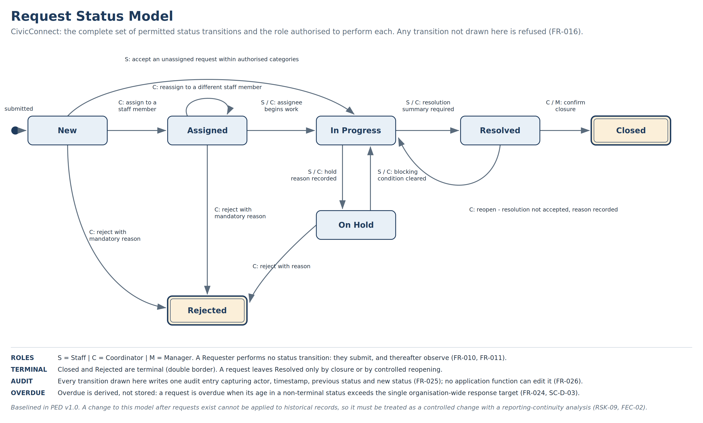
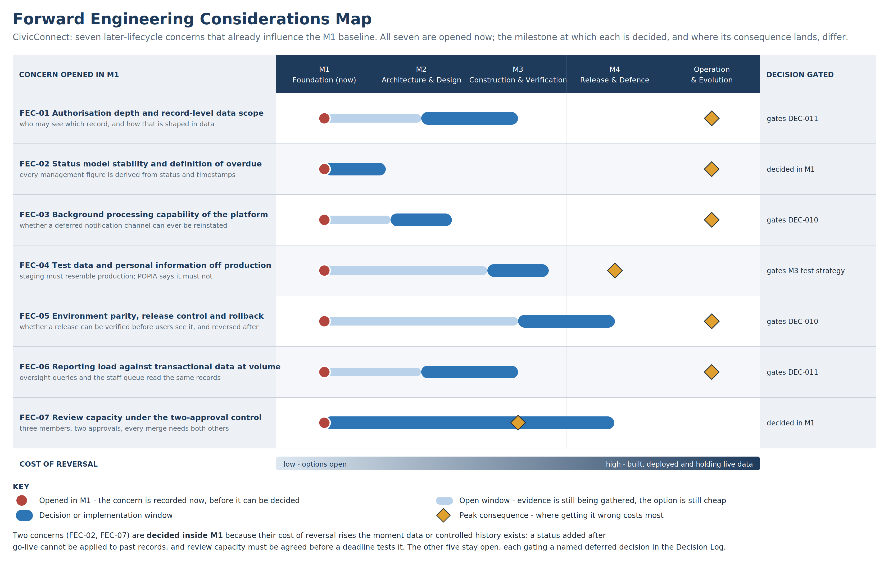
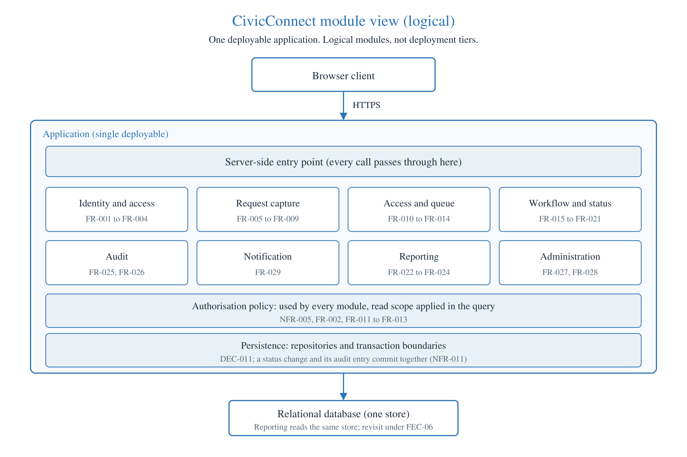
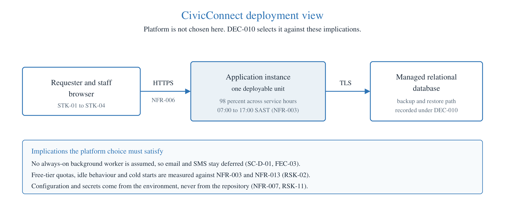

**SOFTWARE ENGINEERING 381 \| SEN381**

**CivicConnect**

Project Engineering Document (PED) v3.0

*Controlled Construction, Integration, Quality and Release Readiness*

| **Project** | CivicConnect - Community Service Request Management Platform |
|----|----|
| **Milestone** | Milestone 3 - Controlled Construction, Integration, Quality and Release Readiness |
| **Document** | PED v3.0, continued from PED v2.0, which evolved from PED v1.0. PED v1.0 is kept unchanged in the repository as the M1 record. This document evolves through v4.0; it is not recreated per milestone (Master Brief, s6). |
| **Team** | Jean Smit - 600368 \| Tristan Roets - 601764 \| Darius Mushi - 577982 |
| **Baseline status** | v3.0 IN PROGRESS for the M3 submission on 14 October 2026 (#127); its submission information is in s27. v2.0 PROPOSED FOR BASELINE. The team signed it off on 30 September 2026 and recommends it as conditionally accepted (s26.3, #69); it becomes the baseline when #95 merges, and the M2 gate decision is the assessor's. The team signed off v1.0 on the same date, after the M1 submission, with the same recommendation (s16, #69); the M1 gate decision is also the assessor's (#7). |
| **Controlled artefacts** | This document, plus the registers workbook (Requirements, RTM, Risk, Decision Log, Forward Considerations, AI Usage, Change Requests, Status Model, Access Matrix, Working Agreement, Governance, Sign-off). |
| **Repository** | https://github.com/PVY-Smit/civicconnect |
| **Referencing** | Harvard, applied in-text and in the reference list (s17). |

> **Central engineering question this document answers**
>
> What exactly are we committing to engineer, for whom, within what constraints, and what must we consider now to avoid unnecessarily constraining the project later?

> **Milestone boundary**
>
> M1 establishes a controlled foundation. It is deliberately **not** an architecture, technology-selection or implementation milestone (M1 brief, s5). No technology stack, architecture style, database schema, API, user-interface design, design pattern or CI pipeline is decided in this document.
>
> Four such decisions are recorded in the Engineering Decision Log as **deliberately deferred**, each with the evidence still required before it can responsibly be taken (s13.2). Recording a future constraint is not the same as deciding it.

> **Milestone 2 boundary**
>
> M2 takes the architecture, technology and initial design decisions M1 deferred, and records them in s18 to s26 with their ADRs. It decides what the application is built from and how its core rules are enforced. It does not select the quality, security, deployment and operational controls that Milestone 3 decides, informed by Assignment 3.

# 1. Document Control and Version History

This document is a controlled artefact. Baselined content is not silently overwritten: changes after sign-off enter through the change control process in s12.4 and are recorded here (Master Brief, s6.1).

| **Version** | **Date** | **Author(s)** | **Summary of change** | **Reviewed by** | **Status** |
|----|----|----|----|----|----|
| 0.1 | 3 September 2026 | Jean Smit | Full initial draft: problem and business need, stakeholders, scope baseline, constraints, functional and non-functional requirements with acceptance criteria, RTM, Risk Register, Forward Engineering Considerations, Decision Log and governance. AI-assisted; recorded in s14.2. | Not reviewed. Direct commit, predating the branch controls established on 4 September 2026. | Superseded |
| 0.2 | 8 September 2026 | Jean Smit, Darius Mushi | Evidence completion: AI Usage Register entries, the GitHub Governance evidence column, forward-consideration to decision links, and correction of the page layout so that no table or figure is truncated. | Reviewed through Pull Request by Darius Mushi and Tristan Roets, against issues \#5, \#6, \#10, \#17, \#20 and \#21. | Superseded |
| 1.0 | 9 September 2026 | Jean Smit, Darius Mushi | Submitted to the M1 engineering gate. The gate has not yet been held: the outcome, the readiness fields and the three approvals are recorded in s16 and are still incomplete. | Reviewed through Pull Request by Darius Mushi and Tristan Roets. Gate review pending. | Proposed baseline, not yet accepted |
| 2.0 | Signed off by the team 30 September 2026; revised after review 5 to 7 October 2026 | Jean Smit, Darius Mushi, Tristan Roets | Milestone 2. Source moved from Word to markdown, with the Word document generated from it (CR-001, #55). Sections 18 to 26 added for the architecture, technology and initial design baseline, after the reference list so that no M1 section number changes. Changes to M1 sections, each under change control (s12.4): the reading note in s8.3 on the four Access Matrix cells (CR-002, #92); the reading note in s9 on the RTM's M2 columns (CR-003); and, under CR-005 (proposed on #95 and recorded in the Change Requests sheet once the team agrees), the cover updated for v2.0, the Milestone 2 boundary note under the M1 one, the paragraph in s2 on how the M1 and M2 sections relate, the reading notes in s10, s13 and s14.2 that point to the live registers, four references added to s17 for s20, s24 and s26.2, the removal of the M1 template instruction under this table, and the team's M1 sign-off recorded in s16 as its recommendation (#69). The assessor's M1 gate decision is still pending, so the v1.0 row above stands. No other M1 content is changed: `tools/ped_fidelity.py --m1-only` lists every difference from v1.0 in sections 1 to 17. | Through the Pull Requests listed in s25 and s26 | Proposed for baseline: signed off by the team on #69, baselined when #95 merges (s26.3) |
| 3.0 | In progress | Jean Smit, Darius Mushi, Tristan Roets | Milestone 3. Sections 27 to 36 added for construction, verification and release readiness, with the M3 submission information in s27 (#127). The cover names v3.0 and Milestone 3 (CR-005, item 1, as widened on #95). Sections 1 to 26 are otherwise unchanged. | | In progress |

# 2. Purpose and How to Read This Document

PED v1.0 records what CivicConnect is committing to engineer, for whom, under which constraints, and what has deliberately been left open. It is the reference against which every later milestone measures change.

**From v2.0.** Sections 1 to 17 are the M1 baseline and keep their numbers, because the registers and the repository cite them. Milestone 2 is recorded in sections 18 to 26, placed after the reference list for that reason, and s17 holds the references for the whole document. Where M2 changes an M1 section, the change is recorded in the version history in s1 rather than made silently.

| **Convention** | **What it means** |
|----|----|
| Identifiers | STK stakeholder, SC scope item, FR functional requirement, NFR non-functional requirement, CON constraint, RSK risk, FEC forward engineering consideration, DEC decision, TR traceability row, CR change request. Identifiers are stable after baseline and are never renumbered, because the traceability matrix and every register reference them. |
| Researched fact against team judgement | A claim supported by a standard, a regulation or the project brief carries a Harvard citation. A claim that is the team's own engineering judgement is labelled as such. The two are never presented as the same kind of evidence (M1 brief, s9.1). |
| Live registers | The full requirements set, RTM, risk register, decision log, forward considerations, AI usage register and change register are maintained in the accompanying workbook and in the repository. This document reproduces them and, where a register is long, presents an extract and names where the live version lives. |
| Square brackets | Any value in \[square brackets\] is a placeholder that the team must complete before submission. |

# 3. Problem Statement and Business Need

The organisation currently manages service requests across email, telephone calls, WhatsApp messages, spreadsheets and paper records. The Master Brief describes the resulting failures directly: requests are duplicated, overlooked, misassigned or lost between channels; requesters cannot tell whether a request was received, assigned, delayed or resolved; staff struggle to prioritise and to establish ownership; accountability for status changes is weak; management lacks reliable information about outstanding and overdue work; reporting is manual and difficult to audit; and sensitive information is handled inconsistently across informal channels (Belgium Campus ITversity, 2026a).

**Team interpretation of the underlying engineering problem.** These are not seven separate problems. They are seven symptoms of one absence: there is no single controlled record of the lifecycle of a service request. Every symptom follows from that. Duplication happens because no channel can see what another has already accepted. Requesters chase by telephone because no authoritative status exists to consult. Accountability is weak because a status change leaves no durable trace. Reporting is manual because there is nothing to query.

That framing has a direct engineering consequence, and it is why the scope baseline in s6 looks as it does. If the defining property of the solution is a single controlled record, then adding an uncontrolled intake channel does not extend the platform, it reintroduces the original problem. This is the reasoning behind the exclusion defended in s6.4.

## 3.1 Business need

The organisation needs a controlled digital platform providing a reliable, traceable and usable way to submit, manage, monitor and report on service requests, without creating an unsustainable technical, operational or financial burden (Belgium Campus ITversity, 2026a). The final clause is a constraint, not an aspiration, and it is carried into CON-03 and NFR-013.

# 4. Definition of Success for CivicConnect

**Team judgement, derived from Master Brief s5.** Success is not that the system runs. The measures below are stated now so that M4 can be evaluated against something agreed in advance rather than against whatever was achieved.

| **Dimension** | **What success means for CivicConnect** | **How it will be evidenced** |
|----|----|----|
| Stakeholder value | A requester can establish the state of their request without contacting anyone, and a coordinator can establish ownership of every open request. | Acceptance of FR-009 to FR-012 and FR-013 to FR-015; stakeholder validation in M4. |
| Single controlled record | Every service request has exactly one authoritative record and one auditable history. | FR-025, FR-026 and the audit reconciliation in NFR-011. |
| Scope | What was delivered matches what was baselined here, or differs only through recorded, approved change. | This baseline, the change register and the M4 delivered-against-approved comparison. |
| Quality and security | The measurable targets in s8.3 are met, or the shortfall is stated with its residual risk rather than concealed. | Test and measurement evidence in M3 and M4 against each NFR target. |
| Constraint honesty | The team can explain what it did not build and why, in constraint terms rather than as an apology. | Sections 6.2, 6.3, 6.4 and the deferred decisions in s13.2. |

# 5. Stakeholder Analysis

Stakeholders are recorded with their needs, their influence and interest, and, where they exist, the conflicts between them. The final column matters most: a stakeholder analysis that records no conflict has not been done, because competing expectations are the reason requirements engineering is necessary at all.

| **ID** | **Stakeholder** | **Role and interest** | **Needs** | **Infl.** | **Int.** | **Conflicts and how this baseline resolves them** |
|----|----|----|----|----|----|----|
| STK-01 | Requester (community member or staff submitting a request) | Raises service requests and needs to know what happened to them | Simple submission; confirmation that the request was received; visible status without chasing anyone; a record of past requests | Low | High | Wants full visibility of who is working on the request and what they have written. Conflicts with STK-02, who needs candid internal working notes. Resolved by DEC-003. |
| STK-02 | Service staff / technician | Carries out the work and records what was done | A queue of only relevant work; enough detail to act without phoning back; ability to record honest internal notes; not to be interrupted across five channels | Medium | High | Wants broad visibility of all requests for context. Conflicts with the least-privilege security constraint. Resolved by scoping the queue to authorised categories (FR-013) rather than granting global read. |
| STK-03 | Service coordinator / supervisor | Assigns work, sets priority and keeps the queue moving | Reliable prioritisation; clear ownership of every request; ability to reassign; visibility of ageing and overdue work | High | High | Needs to own priority. Conflicts with STK-01, who wants to declare their own request urgent. Resolved by DEC-002: requester urgency is an input, coordinator sets priority. |
| STK-04 | Management / oversight | Accountable for service performance and reporting | Trustworthy counts of open, overdue, resolved and closed work; breakdown by category; an auditable record of who changed what | High | Medium | Wants rich analytics and export. Conflicts with the schedule and cost constraints. Resolved by baselining a minimal reporting set (FR-022 to FR-024) and deferring the analytics dashboard. |
| STK-05 | System administrator (role held by STK-04 in this baseline) | Maintains users, roles and the controlled category list | Add and deactivate users; maintain categories without breaking historical records | Medium | Medium | Deleting a category would orphan historical requests. Resolved by FR-027: categories are deactivated, never deleted. |
| STK-06 | Organisation / project sponsor | Funds and owns the platform; accountable for the business outcome | Improved visibility and accountability without an unsustainable technical, operational or financial burden (Master Brief, s2.1) | High | Medium | Cost ceiling constrains the availability target. See CON-03 and the trade-off analysis in s7.1. |
| STK-07 | Information officer / data subject interest | Personal information in requests is processed lawfully | Minimal personal information collected; access restricted to those who need it; a defined retention position | Medium | Low | Privacy minimisation conflicts with STK-04's appetite for detailed reporting. Resolved by aggregate reporting (FR-022) rather than personal-level performance data in the baseline. |
| STK-08 | SEN381 lecturer / assessor (acting client and approving authority) | Approves the baseline and issues controlled change | Controlled, traceable and defensible engineering evidence; a formal change request will be issued in M3 (Master Brief, s20.3) | High | High | The known M3 change request is treated as a planned event, not a surprise. See RSK-03. |
| STK-09 | Development team (three registered students) | Engineers, operates and defends the system | Achievable scope within the delivery period; a stack the team can actually learn and support; time for review and verification | High | High | Capability is a resource constraint that limits buildable scope. See CON-06 and RSK-01. |

## 5.1 The conflict that shaped this baseline most

**Team judgement.** The hardest expectation to reconcile was STK-01 against STK-02. A requester who has been ignored across five channels wants total visibility, including who is working on the request and what they have written about it. A staff member needs to record candid working notes - that a site was inaccessible, that a previous repair was done badly, that a requester was abusive - and will simply stop recording them if they are published.

Both needs are legitimate and neither can be dismissed. Resolving it by satisfying either side fully damages the record the platform exists to create: full publication produces an empty action log, and full concealment returns the requester to the telephone. The baseline therefore splits the artefact rather than choosing a side: every action entry carries an explicit visibility marking, chosen at the time of writing, with no default (FR-017), and the requester view returns only entries marked requester-visible (FR-011). The cost is one deliberate decision per entry, and the risk is that a mis-marked entry is a disclosure, which is why FR-017 forbids a silent default and why this is recorded as DEC-003.

# 6. Scope Baseline

Scope is baselined at PED v1.0. An item moves between the three lists below only through a recorded change request with impact analysis (Master Brief, s14).

## 6.1 In scope

| **ID** | **Committed capability** | **Requirements** |
|----|----|----|
| SC-I-01 | Authenticated access with four roles: Requester, Staff, Coordinator, Manager | FR-001 to FR-004 |
| SC-I-02 | Service request submission with a controlled category, description, location and reported urgency | FR-005 to FR-009 |
| SC-I-03 | A unique, human-readable request reference issued at submission | FR-008 |
| SC-I-04 | Requester visibility of their own requests, current status and status history | FR-010 to FR-012 |
| SC-I-05 | Staff work queue with search, filter and sort | FR-013, FR-014 |
| SC-I-06 | Assignment and acceptance of ownership | FR-015 |
| SC-I-07 | Controlled status transitions across a single agreed status model | FR-016, FR-018 to FR-020 |
| SC-I-08 | Action and comment log separated into internal and requester-visible entries | FR-017 |
| SC-I-09 | Coordinator-owned prioritisation | FR-021 |
| SC-I-10 | Management view of open, overdue, resolved and closed counts, by category and status | FR-022 to FR-024 |
| SC-I-11 | Append-only audit trail of status, assignment and priority changes | FR-025, FR-026 |
| SC-I-12 | Maintenance of the controlled category list and user deactivation | FR-027, FR-028 |
| SC-I-13 | In-application notification of acceptance, update, rejection and completion | FR-009, FR-029 |

## 6.2 Out of scope

These are not deferred. They are not intended for delivery in this project.

| **ID** | **Excluded** | **Why** |
|----|----|----|
| SC-O-01 | Migration of historical requests from email, spreadsheets, WhatsApp or paper records | No controlled source data exists to migrate, and the quality of the informal records is unknown. Migrating unverified records would corrupt the reporting the platform exists to provide. |
| SC-O-02 | Integration with the existing telephone, email or WhatsApp channels | See the defended exclusion in s6.4. Re-admitting uncontrolled channels would recreate the fragmentation identified in the Master Brief s2. |
| SC-O-03 | Native mobile applications | A responsive web interface meets the stated requester need. A native application multiplies build, test, store-release and maintenance obligations across two additional platforms. |
| SC-O-04 | Cost, procurement, work-order or contractor payment handling | Outside the stated business need. Introduces financial data and a materially higher security and audit obligation. |
| SC-O-05 | Anonymous public submission without an account | Conflicts with FR-012 record isolation and with the accountability the platform exists to establish; also removes the ability to give the requester status visibility. |
| SC-O-06 | External vendor SLA and contract management | No stakeholder in the analysis owns this need. |

## 6.3 Deferred and future scope

Deferred items may enter a later milestone through change control if their reconsideration trigger is met. They are recorded now because several of them constrain decisions that will be taken in M2 even while they remain unbuilt.

| **ID** | **Deferred** | **Why deferred** | **Reconsider when** |
|----|----|----|----|
| SC-D-01 | Email or SMS notification channel | Requires an always-on background worker or scheduled job. Whether that is available within the cost constraint is unknown until the deployment platform is decided in M2. See FEC-03. | M2 platform decision confirms background-process support within free or low-cost limits |
| SC-D-02 | File attachments on requests (for example a photograph of a fault) | See the defended exclusion in s6.4. | Storage cost, content-type validation, malware scanning and a retention position are all specified and affordable |
| SC-D-03 | Configurable per-category service targets and automated escalation | The baseline uses a single organisation-wide response target so that 'overdue' has one unambiguous definition (FEC-02). Per-category targets multiply the reporting and test surface. | The organisation confirms differentiated targets are actually required and supplies the values |
| SC-D-04 | Analytics dashboard with trend charts and data export | Management need is met in the baseline by counts and breakdowns. Charting and export add build and verification cost that the schedule cannot absorb in M1 to M3. | Baseline reporting is delivered and stakeholder feedback confirms the gap |
| SC-D-05 | Multi-site or multi-organisation separation | Not required by the stated scenario, but it is a data-model property that cannot be added cheaply later. Recorded now so the M2 data design keeps the option open. See FEC-01. | The organisation confirms more than one site or tenant is in view |
| SC-D-06 | Bulk import of historical requests | Depends on SC-O-01 being reconsidered and on a source of acceptable quality being identified. | A controlled, quality-assessed source dataset is provided |

## 6.4 Defended exclusions

The milestone brief (Belgium Campus ITversity, 2026b) requires the team to defend at least one deliberate exclusion or deferment. Two are defended here, because they were the two hardest to give up and are the two most likely to be questioned.

### 6.4.1 File attachments on a request (deferred, SC-D-02)

**The value being given up is real.** A photograph of a broken gate or a leaking pipe conveys more than a paragraph of description, would reduce diagnostic visits by staff, and is the single feature a requester is most likely to expect from a modern platform. The team is not deferring this because it is unimportant.

**The obligations it carries.** Accepting a file from an unauthenticated-in-practice user population means content-type validation that cannot be satisfied by checking the file extension, malware scanning, a storage location with an access model of its own, a size limit with an enforcement point, and a retention position. It also means personal information inside images, which the team cannot minimise by field design because it has no control over what a photograph contains: a picture of a damaged door may include a face, a vehicle registration or an address. That engages POPIA s19 obligations directly (Republic of South Africa, 2013), and it engages them on data the team cannot inspect in advance.

**The constraint that decides it.** CON-02 and CON-03 together. Storage beyond a free-tier allowance has a cost the sponsor has not agreed, and the security work above is not achievable to a defensible standard within the delivery period alongside the committed scope. A half-controlled attachment feature is materially worse than none: it creates an exposure the team would then have to defend in M4 rather than a gap it can explain now.

**What makes the deferral safe rather than lazy.** The deferral is only sound if it stays reversible, which is why FEC-01 and DEC-006 both record that the M2 data design must leave room for an attachment relationship without a later migration. The reconsideration trigger is explicit: storage cost, content-type validation, malware scanning and a retention position all specified and affordable.

### 6.4.2 Integration with the existing email, telephone and WhatsApp channels (excluded, SC-O-02)

**Why it is tempting.** Requesters already use those channels. Integrating them would remove the adoption barrier entirely, and a stakeholder would reasonably ask why the platform does not simply absorb the traffic it is replacing.

**Why it is excluded rather than deferred.** This is the exclusion that follows directly from the problem framing in s3. The failure being solved is the absence of a single controlled record; the fragmentation across channels is the cause, not an inconvenient detail of it. An integration that accepts requests from WhatsApp reintroduces an intake path with no authentication, no controlled category, no mandatory fields and no audit identity - which means it reintroduces exactly the duplication, loss and weak accountability the platform exists to remove. The integration would not extend the solution; it would restore the problem inside it.

**Team judgement on the honest limitation.** This is a real cost, and it should be stated plainly rather than argued away: requesters must change how they raise requests, and adoption is therefore a business change problem the platform alone does not solve. The team's position is that this cost is worth paying because the alternative defeats the purpose of the system, but it is a trade-off, not a free choice, and it is one the sponsor should be told about explicitly.

# 7. Constraints and Their Engineering Implications

| **ID** | **Type** | **Constraint** | **Engineering implication** |
|----|----|----|----|
| CON-01 | Scope | The minimum business capabilities in Master Brief s3 are non-negotiable. Committed scope is baselined at PED v1.0 and may change only through the change control in Master Brief s14. | Fixes the floor of the requirement set. Any addition must be paid for from schedule, and the team has no schedule reserve, so additions displace other committed work rather than extending the deadline. |
| CON-02 | Schedule | Four assessed milestones within the SEN381 delivery period. The team works on CivicConnect alongside other modules, so available engineering time is bounded and uneven across the term. | The binding constraint on scope. It is the reason SC-D-01 to SC-D-06 are deferred rather than attempted, and the reason quality gates are defined now: under schedule pressure, testing and security are the first things silently dropped (Master Brief, s18). |
| CON-03 | Cost and resources | Free or low-cost services are preferred. Limitations and likely operational cost beyond the educational context must be identified (Master Brief, s4). Three students; no budget for paid tiers or paid tooling. | Directly limits the availability target in NFR-003 and the feasibility of SC-D-01. See the worked trade-off in s7.1. |
| CON-04 | Quality | Quality attributes must be measurable and supported by evidence, not asserted (Master Brief, s4 and s15). | Every NFR in s6.3 carries a stated measurement method. An attribute the team cannot measure within the constraints was either made measurable or removed. |
| CON-05 | Security | Security is a lifecycle-wide responsibility (Master Brief, s16). The system holds personal information, which engages POPIA s19 (Republic of South Africa, 2013). | Constrains the data model (FEC-01), test data (FEC-04) and the deferral of attachments (s6.4). Security requirements appear in the baseline as NFR-004 to NFR-008, not as a later hardening task. |
| CON-06 | Team capability | Three students with prior exposure to programming, databases and web development, and limited exposure to controlled team engineering at this scale. Capability is stated honestly here because it is a real input to the M2 technology decision (Master Brief, s18.1). | Bounds which architectures and stacks are realistically buildable and supportable. An unfamiliar stack converts schedule into learning time. See RSK-01. |
| CON-07 | Platform availability | Belgium Campus cannot guarantee that a chosen language, framework, service or deployment platform is installed, available or supported on the BC Desktop platform (Master Brief, s25). | Makes environment availability a precondition of the M2 technology decision rather than a discovery during construction. Recorded as RSK-02 and as a criterion in DEC-008. |
| CON-08 | Process and governance | Protected main, Pull Requests for substantive change and a minimum of two approvals from members other than the author (Master Brief, s9). | With three members this means every merge needs both other members. It is a quality control and a throughput constraint at the same time. See RSK-04 and FEC-07. |

## 7.1 Worked constraint interaction: cost, availability and a deferred feature

The milestone brief requires at least one constraint interaction or ripple effect to be explained rather than listed. The following chain is the one that most shapes this baseline.

| **Step** | **What happens** |
|----|----|
| 1\. The cost constraint bites first | CON-03 directs the team to free or low-cost services. That is a project constraint, not a technical preference, and the team has no budget to override it. |
| 2\. It propagates into a quality target | Free hosting tiers commonly idle or suspend inactive instances and publish no uptime guarantee. An unqualified availability target would therefore be a claim the team could not evidence, and unsupported claims are explicitly not accepted (Master Brief, s23). NFR-003 is consequently scoped to 98 per cent within published service hours rather than stated as continuous availability, and it is measured by an external probe against a health endpoint so that the figure is observable rather than asserted. |
| 3\. It propagates again into scope | The same free-tier limits typically restrict always-on workers and scheduled jobs. An email or SMS notification channel needs exactly that. The team cannot responsibly commit to a notification channel before knowing whether the platform can host one, so SC-D-01 is deferred rather than promised, and DEC-005 records the reasoning. |
| 4\. It changes a later decision criterion | Because the deferral depends on a platform capability, background-process support becomes a required criterion in the M2 platform decision rather than a detail discovered during construction. This is recorded as FEC-03 and written into DEC-010. |
| 5\. It leaves a residual risk that is owned, not hidden | If no affordable platform supports both the availability target and a background worker, the deferral becomes a permanent exclusion and NFR-003 must be revised through change control. That outcome is recorded as RSK-02 with a named owner and a contingency, so it is a managed risk rather than a surprise. |

> **What this chain demonstrates**
>
> One financial constraint, applied honestly, changed a quality target, removed a feature from committed scope, added a criterion to a decision that will not be taken for another milestone, and generated a risk with an owner. None of those five effects is visible if constraints are recorded as a list. This is the reasoning the team is prepared to defend when asked how a constraint influenced the baseline.

# 8. Requirements and Acceptance Criteria

**Approach.** Requirements are written to be individually verifiable, unambiguous and singular, following the characteristics of a well-formed requirement in ISO/IEC/IEEE 29148:2018 (ISO/IEC/IEEE, 2018). Each carries a unique identifier, a stakeholder source, a MoSCoW priority and acceptance criteria expressed so that a tester can determine pass or fail without asking the author what was meant. Priorities are recorded because RSK-03 designates the Should and Could set as the absorption buffer for the change request expected in M3.

**Note on the acceptance criteria.** Several criteria specify that a refusal must hold when the request is issued directly to the endpoint rather than through the interface. That wording is deliberate: authorisation implemented only in the user interface is not authorisation, and stating it in the criterion is what makes the M3 negative tests derivable from this document (NFR-005).

## 8.1 Functional requirements

| **ID** | **Requirement** | **Source** | **Priority** | **Acceptance criteria** | **Status** |
|----|----|----|----|----|----|
| FR-001 | The system shall require a registered user to authenticate with a unique identifier and secret before any service request data is returned. | STK-06, STK-07 | Must | GIVEN an unauthenticated visitor WHEN any protected page or endpoint is requested THEN no request data is returned and the visitor is redirected to sign-in. GIVEN valid credentials WHEN submitted THEN an authenticated session is established. GIVEN invalid credentials WHEN submitted THEN a single generic failure message is shown that does not reveal whether the identifier exists. | Baselined |
| FR-002 | The system shall enforce role-based access control for the roles Requester, Staff, Coordinator and Manager, with every permission decision made server-side. | STK-03, STK-06 | Must | For every role and function pair in the access matrix (s8.4), a user holding the role can invoke the permitted functions and receives an authorisation failure for every function not permitted to that role, including when the request is issued directly to the endpoint rather than through the interface. | Baselined |
| FR-003 | The system shall allow a Manager to create a user account and assign exactly one role to it. | STK-05 | Must | GIVEN a Manager WHEN a new account is created with a role THEN the account can authenticate and holds only that role's permissions. A non-Manager attempting account creation is refused. | Baselined |
| FR-004 | The system shall allow a user to reset a forgotten credential through a controlled process that does not disclose whether an account exists. | STK-01 | Should | GIVEN a reset request for any identifier WHEN submitted THEN the same confirmation message is shown whether or not the account exists. A reset link is single-use and expires within a defined period. | Baselined |
| FR-005 | The system shall allow a Requester to submit a service request capturing title, description, category, location and reported urgency. | STK-01 | Must | GIVEN a Requester with all mandatory fields completed WHEN the request is submitted THEN the request is persisted with status New and is visible in the Requester's own list. Every field captured is displayed unchanged on the request detail view. | Baselined |
| FR-006 | The system shall require the request category to be selected from a controlled list maintained by a Manager, and shall not accept a free-text category. | STK-04, STK-05 | Must | The category input offers only active categories from the controlled list. A submission carrying a category value that is not an active list entry is rejected with a validation error, including when submitted directly to the endpoint. | Baselined |
| FR-007 | The system shall validate mandatory fields and field formats before accepting a submission, and shall report each failure in a message that identifies the field and the correction needed. | STK-01 | Must | GIVEN a submission with a missing or invalid mandatory field WHEN submitted THEN the request is not persisted, each failing field is identified, and previously entered values are retained in the form. | Baselined |
| FR-008 | The system shall assign every accepted request a unique, human-readable reference that is never reused. | STK-01, STK-03 | Must | Each accepted submission receives a reference matching the agreed format. Two requests never share a reference. A reference is not reissued after a request is deleted or archived. The reference is displayed on submission and on every subsequent view of that request. | Baselined |
| FR-009 | The system shall present the Requester with an in-application acknowledgement on successful submission, showing the reference and the date and time recorded. | STK-01 | Must | GIVEN a successful submission WHEN the acknowledgement is displayed THEN it contains the reference and the recorded timestamp, and the same values appear on the request detail view. | Baselined |
| FR-010 | The system shall allow a Requester to view a list of their own requests showing reference, title, category, current status, submission date and date of last update. | STK-01 | Must | GIVEN a Requester with at least one request WHEN the list is opened THEN every request they submitted appears exactly once with all six fields populated, and no request submitted by another user appears. | Baselined |
| FR-011 | The system shall allow a Requester to view the full detail and status history of their own request, showing only entries marked requester-visible. | STK-01, STK-02 | Must | The detail view shows the request fields, the ordered status history with timestamps, and only those action entries marked requester-visible. No entry marked internal appears in the response payload, not only in the rendered page. | Baselined |
| FR-012 | The system shall prevent a Requester from retrieving any request they did not submit. | STK-01, STK-07 | Must | GIVEN Requester A and a request belonging to Requester B WHEN A requests that record by reference or identifier, through the interface or directly THEN access is refused and no field of the record is disclosed, including through an error message. | Baselined |
| FR-013 | The system shall present Staff and Coordinators with a work queue of requests within their authorised category scope. | STK-02, STK-03 | Must | GIVEN a Staff member authorised for a set of categories WHEN the queue is opened THEN every open request in those categories appears and no request outside them appears. A Coordinator sees all categories. | Baselined |
| FR-014 | The system shall allow the queue to be searched by reference and by keyword, filtered by status, category, assignee and date range, and sorted by submission date, last update and priority. | STK-02, STK-03 | Must | Each named search, filter and sort returns only records satisfying the stated condition, filters combine, and an empty result set is reported as such rather than as an error. | Baselined |
| FR-015 | The system shall allow a Coordinator to assign a request to a Staff member, and a Staff member to accept an unassigned request within their authorised categories. | STK-03 | Must | GIVEN a Coordinator WHEN a request is assigned THEN the assignee is recorded and the request appears in that assignee's queue. GIVEN a Staff member and an unassigned request in their scope WHEN accepted THEN they become the assignee. A Staff member cannot assign a request to another user. | Baselined |
| FR-016 | The system shall permit a status change only where the transition is allowed by the request status model (PED Figure 2) and only by a role authorised for that transition. | STK-03, STK-04 | Must | For every ordered pair of statuses, a transition allowed by the model succeeds for an authorised role and every transition not in the model is refused, including when issued directly to the endpoint. A refused transition leaves the stored status unchanged. | Baselined |
| FR-017 | The system shall allow Staff and Coordinators to record a dated action entry against a request, marked either internal or requester-visible at the time of entry. | STK-02 | Must | An entry is stored with author, timestamp and visibility. Visibility must be chosen explicitly; there is no default that silently exposes an internal note. FR-011 governs what the Requester then sees. | Baselined |
| FR-018 | The system shall require a resolution summary before a request may move to Resolved. | STK-03, STK-04 | Must | An attempt to move a request to Resolved without a non-empty resolution summary is refused with a validation message. On success the summary is stored and is requester-visible. | Baselined |
| FR-019 | The system shall allow only a Coordinator or Manager to move a Resolved request to Closed. | STK-03 | Should | A Coordinator or Manager can close a Resolved request. A Staff member or Requester attempting the same transition is refused. Closing is recorded in the audit trail. | Baselined |
| FR-020 | The system shall allow a Coordinator to reject a request with a mandatory reason that is shown to the Requester. | STK-03, STK-01 | Should | Rejection without a reason is refused. On rejection the status becomes Rejected, the reason is stored and appears on the Requester's detail view, and the event is audited. | Baselined |
| FR-021 | The system shall record the Requester's reported urgency as a separate attribute from the priority, and shall allow only a Coordinator to set or change the priority. | STK-01, STK-03 | Must | Reported urgency is captured at submission and is not editable by Staff or Coordinators. Priority is absent until set by a Coordinator. A Requester or Staff member attempting to change priority is refused. Both values are visible to Coordinators. | Baselined |
| FR-022 | The system shall present a Manager with counts of open, overdue, resolved and closed requests for a selected period. | STK-04 | Must | For a seeded dataset with known values, each of the four counts equals the independently calculated value. Overdue uses the single organisation-wide response target defined in the status model. | Baselined |
| FR-023 | The system shall present the request counts broken down by category and by status. | STK-04 | Should | The breakdown totals reconcile exactly to the totals in FR-022 for the same period and filters. | Baselined |
| FR-024 | The system shall list overdue requests with reference, category, age and current assignee. | STK-03, STK-04 | Should | Every request whose age against the response target exceeds the threshold appears exactly once with all four fields populated; no request within the target appears. | Baselined |
| FR-025 | The system shall record an audit entry for every change of status, assignee and priority, capturing the actor, timestamp, previous value and new value. | STK-04, STK-07 | Must | For each of the three change types, performing the change creates exactly one audit entry containing all four fields, and the previous value matches the value held immediately before the change. | Baselined |
| FR-026 | The system shall not provide any application function that edits or deletes an audit entry. | STK-04, STK-07 | Must | No interface or endpoint accepts an update or delete against an audit entry. Attempted modification through an exposed route is refused. Verified by review of the access matrix and by negative test. | Baselined |
| FR-027 | The system shall allow a Manager to add, rename and deactivate a category, and shall not permit deletion of a category that is referenced by any request. | STK-05 | Should | A deactivated category is unavailable for new submissions and remains displayed correctly on existing requests. An attempt to delete a referenced category is refused with an explanatory message. | Baselined |
| FR-028 | The system shall allow a Manager to deactivate a user account so that it can no longer authenticate, while preserving that user's historical records and audit entries. | STK-05 | Could | A deactivated account cannot authenticate. Requests, action entries and audit entries authored by that account remain visible and correctly attributed. | Baselined |
| FR-029 | The system shall present the Requester with an in-application indication when a request they submitted is accepted, updated, rejected or completed. | STK-01 | Must | Following each of the four events, an indication is available to the Requester on next sign-in that identifies the request by reference and the event that occurred. | Baselined |

## 8.2 Non-functional requirements

Every target below states a number and the method by which it is measured. A quality attribute the team could not measure within its constraints was either made measurable or removed, because an unmeasurable target produces an unsupported claim at M4 (Master Brief, s15).

| **ID** | **Quality characteristic (ISO/IEC 25010:2023; ISO, 2023)** | **Requirement** | **Measurable target** | **How it is measured** | **Source** | **Pri.** |
|----|----|----|----|----|----|----|
| NFR-001 | Performance efficiency | Staff queue retrieval shall remain responsive at the baselined data volume. | 95th percentile response under 2.0 seconds for a queue of 5 000 requests returning the first page | 20 timed retrievals against a seeded 5 000-request dataset on the target environment; record the distribution, not the mean | STK-02 | Must |
| NFR-002 | Performance efficiency | Request submission shall confirm quickly enough that the Requester does not resubmit. | 95th percentile under 3.0 seconds from submit to acknowledgement | 20 timed submissions on the target environment under normal conditions | STK-01 | Must |
| NFR-003 | Reliability | The service shall be available during published service hours. | 98 percent availability measured across published service hours (weekdays 07:00 to 17:00 SAST), assessed monthly | External uptime probe at 5-minute intervals against a health endpoint; monthly report. The target is deliberately scoped to service hours because of CON-03; see the trade-off in s7.1 and RSK-02 | STK-06 | Should |
| NFR-004 | Security | Authentication secrets shall not be recoverable from stored data. | Stored using a current, deliberately slow password hashing function with a per-user salt; no plaintext, reversible or unsalted storage anywhere | Inspection of stored values in a test environment plus code review recorded on the Pull Request; supported by NIST (2022) practice PW.4 | STK-06, STK-07 | Must |
| NFR-005 | Security | Authorisation shall be enforced on the server for every protected function. | Zero successful accesses across the full negative-test matrix of role and function pairs | Automated negative tests derived from the access matrix, executed directly against endpoints rather than through the interface; addresses OWASP A01:2025 (OWASP, 2025) | STK-06 | Must |
| NFR-006 | Security | All traffic between client and service shall be encrypted in transit. | 100 percent of requests served over HTTPS; plain HTTP redirected; no mixed content | Automated check of scheme and redirect behaviour in the deployment verification step | STK-06, STK-07 | Must |
| NFR-007 | Security | No credential, key or token shall be present in the repository or its history. | Zero findings from secret scanning across the full commit history | Automated secret scanning on every Pull Request plus a full-history scan before each baseline; addresses Master Brief s9 | STK-06 | Must |
| NFR-008 | Security | Personal information shall be limited to what the service requires and shall be accessible only to roles that need it. | Only name, contact detail and request content are stored as personal information; every field is justified in the data inventory; access is governed by the FR-002 access matrix | Data inventory reviewed at each baseline against the access matrix; POPIA s19 requires appropriate, reasonable technical and organisational measures (Republic of South Africa, 2013) | STK-07 | Must |
| NFR-009 | Interaction capability | A first-time Requester shall be able to submit a request without training or assistance. | At least 4 of 5 representative first-time users complete a submission unaided within 3 minutes | Moderated task test with 5 participants who have not seen the system; record completion, time and observed errors | STK-01 | Should |
| NFR-010 | Interaction capability | The interface shall be operable without a mouse and legible to users with low vision. | All interactive controls reachable and operable by keyboard with a visible focus indicator; every form control programmatically labelled; body text contrast at least 4.5:1 | Keyboard traversal of each primary flow plus automated contrast and label checks, against the WCAG 2.2 Level AA criteria cited (W3C, 2023) | STK-01 | Should |
| NFR-011 | Functional suitability | Every change to status, assignee or priority shall produce an audit record. | 100 percent of such changes produce exactly one complete audit entry; no orphaned or partial entries | Automated test asserting audit entry creation for each change type, plus a reconciliation query comparing change counts to audit counts | STK-04 | Must |
| NFR-012 | Maintainability | The team shall be able to change the system without silently breaking committed behaviour. | Automated tests covering every Must-priority functional requirement pass on every Pull Request before merge is permitted | Pull Request check status; the requirement-to-test mapping is held in the RTM. Which tooling provides this is an M2 and M3 decision, not an M1 commitment | STK-09 | Must |
| NFR-013 | Flexibility | The service shall operate within the cost ceiling set by CON-03. | Running cost of zero within free-tier limits for the assessed period, with documented limits and the projected cost beyond the educational context | Platform limit documentation captured in the M2 decision record plus a recorded cost review before production release; unsupported claims that a platform is free are not acceptable (Master Brief, s23) | STK-06 | Must |

## 8.3 Role and function access matrix

This matrix is the authoritative statement of FR-002. Every entry marked No is a negative test case in M3, which is how NFR-005 becomes verifiable rather than aspirational.

*Reading note from v2.0: four cells below grant what the requirements refuse. The Manager may assign, reject and set priority, and the Coordinator may accept an unassigned request, where FR-015, FR-020 and FR-021, with the Status Model that FR-016 makes authoritative for transitions, give those moves to other roles. The authorisation policy built in M2 denies all four (s22.2). On 30 September 2026 the team decided to correct the matrix to the requirements (CR-002, #69); the correction of the Access Matrix and of this table is M3 work under #92.*

| **Function** | **Requester** | **Staff** | **Coordinator** | **Manager** |
|----|----|----|----|----|
| Submit a request | Yes | Yes | Yes | Yes |
| View own requests | Yes | Yes | Yes | Yes |
| View any request in authorised categories | No | Yes | Yes | Yes |
| View internal action entries | No | Yes | Yes | Yes |
| Assign a request to another user | No | No | Yes | Yes |
| Accept an unassigned request in scope | No | Yes | Yes | No |
| Record an action entry | No | Yes | Yes | Yes |
| Change status (model-permitted transitions) | No | Yes | Yes | Yes |
| Move Resolved to Closed | No | No | Yes | Yes |
| Reject a request | No | No | Yes | Yes |
| Set or change priority | No | No | Yes | Yes |
| View management counts and breakdowns | No | No | Yes | Yes |
| Maintain the category list | No | No | No | Yes |
| Create or deactivate a user account | No | No | No | Yes |
| Edit or delete an audit entry | No | No | No | No |

## 8.4 Request status model

The status model below is baselined in this document rather than deferred to design, because every management figure in FR-022 to FR-024 is derived from status and timestamps, and a state added or redefined after requests exist cannot be applied to historical records. That is recorded as RSK-09 and as FEC-02.

**Figure 2.** CivicConnect request status model. Original diagram produced by the team.

Three properties of this model carry engineering weight. First, it is closed: FR-016 refuses any transition not drawn, which makes the set of valid states testable rather than emergent. Second, no transition belongs to the Requester, which is what makes the audit trail meaningful - every state change has an accountable staff actor. Third, overdue is derived from age against a single organisation-wide target rather than stored as a status, so a request cannot be overdue and In Progress simultaneously in one field and not another. Per-category targets were deliberately deferred (SC-D-03) to keep that definition unambiguous.

# 9. Requirements Traceability Matrix

The live RTM is maintained in the registers workbook and in the repository; it holds one row per requirement, 42 rows in total. The extract below shows its structure. Columns for design, issue and Pull Request, implementation, test and release evidence are present and deliberately empty: they are the structure into which M2, M3 and M4 evidence is added, and their presence now is what makes the M3 change request an impact lookup rather than an investigation (RSK-03).

*Reading note from v2.0: this extract is shown as at the M1 baseline. The live RTM in the registers workbook carries the eight M2 columns (CR-003) for every requirement, with FR-016 traced end to end (#101, #105). s25.2 continues the two traces in s9.1.*

| **RTM ID** | **Source (stakeholder / brief)** | **Req ID** | **Requirement summary** | **Priority** | **Acceptance criteria** | **Related risk / FEC** | **Design ref (M2)** | **Issue / PR (M3)** | **Implementation (M3)** | **Test ref (M3)** | **Release evidence (M4)** | **Status** |
|----|----|----|----|----|----|----|----|----|----|----|----|----|
| TR-001 | STK-06, STK-07 | FR-001 | The system shall require a registered user to authenticate with a unique identifier and secret before any service requ... | Must | See requirements register | RSK-05 | Pending M2 | Pending M3 | Pending M3 | Pending M3 | Pending M4 | Baselined |
| TR-002 | STK-03, STK-06 | FR-002 | The system shall enforce role-based access control for the roles Requester, Staff, Coordinator and Manager, with every... | Must | See requirements register | RSK-05, FEC-01 | Pending M2 | Pending M3 | Pending M3 | Pending M3 | Pending M4 | Baselined |
| TR-003 | STK-05 | FR-003 | The system shall allow a Manager to create a user account and assign exactly one role to it. | Must | See requirements register | \- | Pending M2 | Pending M3 | Pending M3 | Pending M3 | Pending M4 | Baselined |
| TR-004 | STK-01 | FR-004 | The system shall allow a user to reset a forgotten credential through a controlled process that does not disclose whet... | Should | See requirements register | RSK-05 | Pending M2 | Pending M3 | Pending M3 | Pending M3 | Pending M4 | Baselined |
| TR-005 | STK-01 | FR-005 | The system shall allow a Requester to submit a service request capturing title, description, category, location and re... | Must | See requirements register | \- | Pending M2 | Pending M3 | Pending M3 | Pending M3 | Pending M4 | Baselined |
| TR-006 | STK-04, STK-05 | FR-006 | The system shall require the request category to be selected from a controlled list maintained by a Manager, and shall... | Must | See requirements register | FEC-02 | Pending M2 | Pending M3 | Pending M3 | Pending M3 | Pending M4 | Baselined |
| TR-007 | STK-01 | FR-007 | The system shall validate mandatory fields and field formats before accepting a submission, and shall report each fail... | Must | See requirements register | \- | Pending M2 | Pending M3 | Pending M3 | Pending M3 | Pending M4 | Baselined |
| TR-008 | STK-01, STK-03 | FR-008 | The system shall assign every accepted request a unique, human-readable reference that is never reused. | Must | See requirements register | \- | Pending M2 | Pending M3 | Pending M3 | Pending M3 | Pending M4 | Baselined |

## 9.1 One requirement traced end to end on the evidence available today

The milestone brief asks for one requirement traced end to end for the evidence that currently exists. The trace below is deliberately shown with its future links empty rather than filled with intentions.

| **Link in the chain** | **Evidence today** |
|----|----|
| Stakeholder need | STK-01, Requester: "know that my request was received, and what is happening to it now." Recorded in s5 with its conflict against STK-02. |
| Business need | Master Brief s2: requesters have limited visibility of whether a request was received, assigned, delayed, resolved or closed (Belgium Campus ITversity, 2026a). |
| Requirement | FR-011: the Requester may view the full detail and status history of their own request, showing only entries marked requester-visible. Priority Must. Source STK-01, STK-02. |
| Acceptance criteria | The detail view shows the request fields, the ordered status history with timestamps, and only entries marked requester-visible. No internal entry appears in the response payload, not only in the rendered page. |
| Decision it depends on | DEC-003: visibility is chosen explicitly per action entry, with no default. Without that decision the requirement is not implementable as written. |
| Constraint it engages | CON-05 security, through least privilege and POPIA minimisation. |
| Risk it mitigates | RSK-05, disclosure of personal information to a user not entitled to see it. Exposure 15, High. |
| Forward consideration | FEC-01: the requester-visible split is a data-model property, so it constrains the M2 persistence design rather than the interface. |
| Design evidence | Not yet produced. Due M2, tracked as RTM row TR-011, column H. |
| Issue and Pull Request | Not yet produced. Due M3, RTM columns I and J. |
| Test evidence | Not yet produced. Due M3: the negative case asserting that no internal entry appears in the response payload is derived from the acceptance criterion above and from the access matrix in s8.3. |
| Release and acceptance evidence | Not yet produced. Due M4, RTM column L. |

| Link in the chain | Evidence today |
|----|----|
| Stakeholder need | STK-03, Coordinator: "reliable prioritisation, clear ownership of every request." STK-04, Management, needs counts it can trust. |
| Business need | Master Brief s2: there is weak accountability for changes to request status and actions taken, and no single controlled record of a request's lifecycle. |
| Requirement | FR-016: the system shall permit a status change only where the transition is allowed by the request status model (Figure 2) and only by a role authorised for that transition. Must. |
| Acceptance criteria | For every ordered pair of statuses, a transition allowed by the model succeeds for an authorised role, and every transition not in the model is refused, including when issued directly to the endpoint. |
| Decision it depends on | The status model itself, baselined as Figure 2 with all twelve transitions and their authorised roles enumerated on the Status Model sheet. Without a closed model there is nothing for the guard to enforce. |
| Constraint it engages | CON-04 quality, because the acceptance criterion is only meaningful if every pair in the model is actually exercised; and CON-05 security, because the guard is an authorisation check, not a user-interface convenience. |
| Risk it mitigates | RSK-09, the status model proves ambiguous or incomplete after data exists and management reporting becomes unreliable. Probability 2, impact 4, exposure 8, Medium. Owner Darius Mushi. |
| Forward consideration | FEC-02: the model is decided inside M1 rather than deferred, because a status added after go-live cannot be applied to records already closed. It constrains the M2 persistence design and the M3 transition testing. |
| Design evidence | Not yet produced. Due M2, tracked as RTM row TR-016 column H: the architecture or state-diagram reference showing where the transition guard is enforced. |
| Issue and Pull Request | Not yet produced. Due M3, RTM columns I and J: the issue and Pull Request building the guard. |
| Test evidence | Not yet produced. Due M3, RTM column K: a matrix over all ordered status pairs, including the negative case asserting that a transition absent from the model is refused when issued directly to the endpoint rather than through the interface. |
| Release and acceptance evidence | Not yet produced. Due M4, RTM column L: management reporting reconciling against the audit trail, which is what FEC-02 says the model finally has to support. |

At M2, column H (Design ref) will hold the architecture or state-diagram reference showing where FR-016's transition guard is implemented. At M3, columns I - K will hold the issue/PR building the guard logic, its implementation reference, and the automated test reference proving the acceptance criteria, including the direct-to-endpoint negative case, actually passes.

# 10. Risk Register

Risks are scored on probability and impact from 1 to 5. Exposure is the product, and the band is Critical at 20 or above, High from 12 to 19, Medium from 6 to 11 and Low below 6. Scores are the current assessment with the mitigations described in progress, not an inherent rating. The register is live: it is reviewed at every milestone and updated when a risk materialises into an issue (Master Brief, s12).

*Reading note from v2.0: this register holds the M1 entries, RSK-01 to RSK-15, as at the M1 baseline. The live Risk Register in the registers workbook adds RSK-16 to RSK-29 from the M2 ADRs, including RSK-20 (an untested restore) and RSK-26 (one instance while node-cron schedules), which s24 and s26.2 cite. It also re-scores RSK-05 and RSK-12 (#101, #104, #106).*

| **ID** | **Risk** | **Cause** | **P** | **I** | **Exp** | **Band** | **Mitigation** | **Contingency** | **Owner** | **Status** |
|----|----|----|----|----|----|----|----|----|----|----|
| RSK-01 | The team does not reach working competence in the selected stack early enough to build the committed scope, and construction time is consumed by learning. | Technology selection is deferred to M2 (DEC-008) and the team has limited prior exposure to controlled team engineering at this scale (CON-06). | 4 | 5 | 20 | Critical | Make team capability an explicitly weighted criterion in the M2 technology decision. Run a timeboxed proof of concept covering authentication, one persisted entity and one automated test before committing. Prefer a stack in which at least two of three members have prior exposure. | Reduce committed scope to Must-priority requirements only, through a controlled change request, and record the trade-off rather than absorbing it silently. | Tristan Roets | Open |
| RSK-03 | The formal client change request scheduled for M3 arrives against an unchanged deadline and destabilises the baseline. | Master Brief s20.3 states that M3 includes a formal lecturer or client change request and impact analysis. This is a certainty, not a possibility. | 5 | 4 | 20 | Critical | Treat the change as planned work. Keep the RTM complete so impact analysis is a lookup rather than an investigation. Hold the Appendix E impact template ready. Keep Should and Could priority items as the intended absorption buffer so that a change displaces deferred work rather than Must-priority work. | Apply the change control process in Master Brief s14, record scope displacement explicitly, and seek approval for the resulting scope change rather than compressing verification. | Darius Mushi | Open |
| RSK-05 | Personal information held in service requests is disclosed to a user who is not entitled to see it. | Requests contain requester identity, contact detail and free-text description that may include sensitive circumstances. Record-level isolation (FR-012) and internal note separation (FR-011) are data-model properties, not interface behaviour. | 3 | 5 | 15 | High | Enforce authorisation server-side for every function (NFR-005). Derive negative tests directly from the access matrix. Treat record-level scope as an M2 data design input (FEC-01). Minimise stored personal information (NFR-008). | Contain by revoking the affected access, record the incident, assess notification obligations under POPIA, and raise a defect with the highest severity. | Tristan Roets | Open |
| RSK-08 | Repository history does not show authentic progressive engineering, and controlled evidence is discounted despite the software working. | Documentation work feels separable from the repository, so artefacts accumulate locally and are pushed in bulk near a deadline. Master Brief s23 states that reconstructed evidence may receive limited or no credit. | 3 | 5 | 15 | High | Place the PED and every register in the repository from the first week of M1 and change them through Pull Requests like code. Link commits to issues. Review the commit and Pull Request history as a team at each weekly checkpoint. | None available after the fact. This risk cannot be mitigated retrospectively, which is why its mitigation is entirely preventive. | Jean Smit | Open |
| RSK-11 | A credential, key or token is committed to the repository. | Configuration is needed to run locally, and the fastest way to share it between three developers is to commit it. | 3 | 5 | 15 | High | Agree the configuration and secrets approach in the Team Working Agreement before construction. Add ignore rules and secret scanning to the repository at setup, not at M3 (NFR-007). | Treat the secret as compromised: rotate it, and record that history rewriting does not undo exposure. | Jean Smit | Open |
| RSK-02 | The chosen platform's free tier proves unable to meet the availability or background-processing needs, or its terms change during the project. | Cost constraint CON-03 pushes the team to free tiers, whose idle behaviour, quotas and continuity are outside the team's control. Institutional platform support is not guaranteed (CON-07). | 3 | 4 | 12 | High | Record platform limits as explicit criteria in DEC-010 before committing. Verify cold-start and idle behaviour against NFR-003 during M2. Keep the deployment target portable by avoiding platform-specific services in the baseline. | Fall back to a second shortlisted platform identified in M2; if unavailable, revise NFR-003 through change control and record the residual risk rather than restating the target. | Tristan Roets | Open |
| RSK-04 | Controlled change stalls because the mandatory two-approval rule cannot be satisfied when a member is unavailable. | CON-08 requires two approvals from members other than the author. With exactly three members, every merge requires both remaining members, so one absence blocks all controlled change. | 4 | 3 | 12 | High | Agree a 24-hour review turnaround in the Team Working Agreement. Keep Pull Requests small and single-purpose so review is quick. Schedule two fixed review windows per week that all three members hold open. | Where an absence is known in advance, front-load merges before it. Where it is unplanned, record the blockage and its schedule effect rather than bypassing the control or rubber-stamping, which may receive no credit (Master Brief, s9). | Jean Smit | Materialised - active (review delay recorded 9 September 2026) |
| RSK-06 | Committed scope grows without control and the team delivers a larger unfinished system instead of a smaller complete one. | Additional features are permitted where justified (Master Brief, s3.1), and the visible reward for adding a feature is more immediate than the cost of specifying, securing, testing, documenting and maintaining it. | 3 | 4 | 12 | High | Baseline scope at PED v1.0 with an explicit deferred list (s6.3) so that a new idea has a recorded home other than the current sprint. Require any addition to enter through change control with an impact analysis. | Where uncontrolled work is discovered, stop it, assess it through Appendix E, and either approve it with an explicit displacement or return it to the deferred list. | Darius Mushi | Open |
| RSK-13 | The system behaves correctly in development but fails in staging or production because the environments differ. | Environment parity is not free, and free-tier hosting differs from a developer machine in runtime version, filesystem persistence, cold starts and network egress (Master Brief, s17). | 4 | 3 | 12 | High | Record parity as a forward consideration now (FEC-05) so it becomes an explicit M2 platform criterion. Keep environment-specific values in configuration rather than code from the first commit. | Roll back to the previous release, reproduce the difference in staging, and record the parity gap as a known limitation. | Tristan Roets | Open |
| RSK-14 | AI-assisted output is accepted into a controlled artefact without adequate verification, producing a defect or an artefact no member can defend. | AI is permitted throughout the project (Master Brief, s10), and reviewing generated work is slower and less rewarding than accepting it. The statement that AI generated it is never an acceptable engineering defence. | 3 | 4 | 12 | High | Record material AI contributions in the AI Usage Register at the time, not retrospectively. Apply the rule that no member may approve AI-assisted work they cannot explain without the assistant. Subject AI-generated work to the same branch, review and test controls as any other change. | Revert the artefact to its last verified state and re-derive it. Where an artefact cannot be explained by any member, remove it from the baseline. | Jean Smit | Open |
| RSK-07 | A registered member becomes unavailable and the team loses both delivery capacity and that member's contribution evidence. | Illness or other exceptional circumstance, against a fixed milestone calendar and an individually assessed presentation requirement (Master Brief, s25). | 3 | 4 | 12 | High | Rotate authorship so that no artefact has a single owner. Require all three members to review across the whole artefact set, not only their own area. Keep the PED and registers current so any member can present any artefact. | Follow the institutional process for an approved later presentation date. Redistribute committed work through the change process and record the schedule effect. | Jean Smit | Materialised - active (member availability affected M1 review capacity on 9 September 2026) |
| RSK-09 | The request status model proves ambiguous or incomplete after data exists, and management reporting becomes unreliable. | Reporting in FR-022 to FR-024 derives entirely from status and timestamps. A state added or redefined after go-live cannot be applied retrospectively to historical records. | 2 | 4 | 8 | Medium | Agree and baseline the status model now (Figure 2) with every transition and its authorised role enumerated. Define overdue against a single organisation-wide target (SC-D-03). Test every non-permitted transition as well as every permitted one (FR-016). | Treat a model change as a controlled change with an explicit data-migration and reporting-continuity analysis under Appendix E. | Darius Mushi | Open |
| RSK-10 | Real personal information is copied into a development, test or staging environment. | Realistic data is convenient for testing reporting and queue behaviour, and staging is intended to resemble production (Master Brief, s17). | 2 | 4 | 8 | Medium | Commit now to generated test data only. Build the seeding approach as a project artefact in M2 so the convenient path and the correct path are the same one (FEC-04). | Purge the affected environment, rotate any exposed credential, and record the event and its POPIA implications. | Tristan Roets | Open |
| RSK-12 | A third-party dependency introduces a vulnerability or malicious code into the build. | The baseline will rest on an ecosystem of transitive dependencies chosen in M2. OWASP raised software supply chain failures to A03 in 2025 (OWASP, 2025), and Sonatype recorded over 454 600 new malicious open-source packages during 2025 (Sonatype, 2026). | 2 | 4 | 8 | Medium | Make dependency-ecosystem maturity a criterion in DEC-008. Adopt lockfiles and automated dependency and vulnerability checking from the first construction Pull Request. Require any new dependency to be justified in the Pull Request that introduces it. | Remove or replace the affected component, assess exposure, and record the residual risk rather than claiming the system is clean. | Darius Mushi | Open |
| RSK-15 | A controlled engineering artefact cannot be safely reproduced or corrected because only the rendered output is retained. | Generated diagrams or similar artefacts are committed without their editable source or generation script. | 3 | 3 | 9 | Medium | Commit editable source or generation scripts alongside generated artefacts, and regenerate and compare outputs against the authoritative register. | Record the limitation, reconstruct the source, and independently verify the replacement against the controlled evidence before accepting it. | Jean Smit | Materialised - Figure 2, issue \#27 |

## 10.1 The risk that deserves the most attention now

Two risks share the highest exposure of 20. **Team judgement: RSK-03 deserves the most attention now**, and the reason is not its score.

|  | **RSK-01 - team capability against the schedule** | **RSK-03 - the M3 change request against a fixed deadline** |
|----|----|----|
| Probability | 4 - likely, but genuinely uncertain | 5 - certain. Master Brief s20.3 states that M3 includes a formal client change request and impact analysis. It is a scheduled event, not a possibility. |
| Impact | 5 | 4 |
| Can it be acted on now? | Partly. The main mitigation is a proof of concept, which cannot happen until the M2 technology decision is at least shortlisted. | Almost entirely. Every mitigation is available in M1: a complete RTM, the impact template prepared, and a designated absorption buffer. |
| What acting now buys | A better-informed decision in M2. | The difference between impact analysis as a lookup and impact analysis as an investigation, at the point in the project where the team has least spare time. |

**The argument.** A risk register is a list of things that might happen. RSK-03 is not one of them: the brief states it will happen. Treating a certainty as a risk is a category error, and the correct engineering response is to convert it into planned work rather than to monitor it.

That conversion is what most of this baseline is for. The RTM exists in complete form at M1 so that "which requirements does this change affect" is answered by reading a column rather than by re-deriving the analysis. MoSCoW priorities exist so that a change has a designated place to take capacity from: the Should and Could set absorbs it, and Must-priority scope is protected. The Appendix E impact template is prepared before it is needed. The alternative - discovering in M3 that impact analysis requires reconstructing traceability the team never built - costs exactly the time the team will not have.

**RSK-01 is not being neglected.** It carries the same exposure and a higher impact, and it has an owner and a contingency. The distinction is that its useful mitigation window opens in M2, whereas RSK-03's closes at the end of M1. Sequencing attention by when a mitigation is actually available, rather than by score alone, is the judgement being made here.

# 11. Forward Engineering Considerations

These are the later-lifecycle concerns that already influence the M1 baseline. They are recorded, not decided. Assignment 1 research is deliberately not reused here: each concern below is derived from a specific CivicConnect requirement, constraint or control, and is stated with the actual information the team is missing (M1 brief, s4).

| **ID** | **Concern** | **Why it matters now** | **Later decision or activity influenced** | **Information still missing** | **Risk of ignoring it** |
|----|----|----|----|----|----|
| FEC-01 | Authorisation depth and record-level data scope | The baseline already commits to per-Requester record isolation (FR-012), category-scoped Staff queues (FR-013) and internal versus requester-visible entries (FR-011). Each of these is a property of how data is shaped and queried, not a screen behaviour. | M2 data and architecture design; the M3 negative-test matrix derived from the access matrix. | Whether Staff scope is ultimately by category, by site, or global; whether SC-D-05 multi-site separation will ever be required. | Record-level authorisation added after the data model is fixed touches every query and every test, and tends to be implemented in the interface layer where it can be bypassed. |
| FEC-02 | Request status model stability and the definition of overdue | Every management figure in FR-022 to FR-024 is derived from status and timestamps. The model is being baselined now (Figure 2) precisely because it cannot be revised cheaply once requests exist. | M2 persistence design and reporting approach; M3 transition testing; M4 evaluation of whether reporting is trustworthy. | The organisation's actual response target, and whether different categories genuinely need different targets (SC-D-03). | A state added or redefined after go-live cannot be applied to historical records, so the reporting the platform exists to provide becomes unreliable at exactly the point it is first used. |
| FEC-03 | Background processing capability of the deployment platform | Notification beyond the in-application indication is deferred (SC-D-01), but reinstating it needs a scheduled job or always-on worker. Free tiers frequently restrict exactly that, so the M2 platform choice can close the option permanently without anyone noticing. | M2 deployment platform decision (DEC-010); any future change request that reintroduces email or SMS notification. | The background-process, scheduled-job and idle-timeout limits of each candidate platform within free-tier terms. | Choosing a platform on cost and interface alone can make a deferred requirement unimplementable, converting a reversible deferral into an irreversible exclusion. |
| FEC-04 | Test data and personal information in non-production environments | Staging is meant to resemble production (Master Brief, s17), while NFR-008 and POPIA constrain where personal information may exist. These two pull in opposite directions and the tension appears the first time anyone needs realistic data. | M3 test strategy and staging deployment; the seeding approach used for the NFR-001 performance measurement at 5 000 records. | Whether the organisation will provide any real historical data, and the retention position the organisation expects. | Realistic data is usually obtained by copying production. Deciding this after staging exists means the convenient path has already been taken. |
| FEC-05 | Environment parity, release control and rollback | NFR-003 states an availability target and the team has not yet chosen where the system will run. Whether a release can be verified before users see it, and reversed afterwards, is decided by the platform and the release path, not by the application code. | M2 platform decision; M3 staging deployment and production-readiness review; M4 production release and operational evidence. | Platform cold-start and idle behaviour, deployment mechanism, region and data residency, and whether a previous release can be restored quickly. | Discovering in M3 or M4 that staging cannot resemble production, or that a release cannot be reversed, leaves no time to change platform. |
| FEC-06 | Reporting load against the transactional data as volume grows | NFR-001 is stated at 5 000 requests and the management view in FR-022 aggregates across the same records the Staff queue reads. The interaction between the two only appears at volume. | M2 persistence and indexing design; whether reporting reads the transactional store directly; M3 performance evidence. | Expected request volume per month and the retention period, neither of which the organisation has yet supplied. | Aggregate reporting queries running against the same store can degrade the Staff queue, so the feature that provides oversight damages the feature that does the work. |
| FEC-07 | Review capacity under the mandatory two-approval control | CON-08 requires two approvals from members other than the author. With three members this is a throughput constraint on every controlled change from M2 onward, and it is being agreed now in the Team Working Agreement rather than discovered at a deadline. | All controlled change in M2, M3 and M4; the authenticity of the review evidence the project is assessed on. | Each member's realistic weekly availability windows across the remaining milestones. | The pressure at a deadline is to bypass the control or to approve without reading. Both are visible in the history, and rubber-stamped approval may receive no credit (Master Brief, s9). |

## 11.1 Forward Engineering Considerations map

**Figure 1.** Forward Engineering Considerations map. Original diagram produced by the team.

All seven concerns are opened in M1. What differs is when each is decided and where its consequence lands, and the map is drawn to make that difference visible. Five remain deliberately open, each gating a named deferred decision in s13.2, which is what distinguishes a recorded deferral from an oversight.

Two are decided inside M1 rather than deferred, and the reasoning is worth stating because it is the exception. FEC-02, the status model, is decided because its cost of reversal rises the moment the first request exists: a status added later cannot be applied to historical records, so the reporting the platform exists to provide would become unreliable at the point it is first used. FEC-07, review capacity, is decided because the two-approval control applies to controlled work from now onward, and the pressure to bypass it or to approve without reading arrives at a deadline. Agreeing the review commitment in advance is the only mitigation that works, because the alternative is agreeing it under exactly the pressure that defeats it.

# 12. Process, Team Working Agreement and Governance

## 12.1 Team working agreement

| **Area** | **Agreement** |
|----|----|
| Cadence | Two fixed working sessions each week plus one 20-minute checkpoint at which the PED, RTM, Risk Register and repository history are reviewed together. Attendance is recorded. |
| Review turnaround | A Pull Request receives a first review within 24 hours on a working day. This is a commitment made because CON-08 makes every merge dependent on both other members (RSK-04). |
| Review windows | Two windows each week are held open by all three members specifically for review, so that review is scheduled work rather than an interruption. |
| Pull Request size | One issue per Pull Request. A change large enough that a reviewer cannot hold it in their head is split, because approval that does not reflect meaningful review may receive no credit (Master Brief, s9). |
| Definition of done | Change is linked to an issue and a requirement identifier; affected registers are updated in the same Pull Request; checks pass; two approvals from members other than the author; merged by the author after approval. |
| Authorship rotation | No controlled artefact has a single permanent owner. Section ownership in the PED rotates each milestone so every member has authored and reviewed across the whole artefact set (RSK-07). |
| Decision rule | Technical decisions are taken by consensus at a working session and recorded in the Decision Log. Where consensus is not reached within one session the alternatives, the disagreement and the evidence still needed are recorded, and the decision is deferred rather than defaulted. |
| Escalation | A blocking disagreement or a blocked merge lasting more than two working days is raised with the lecturer rather than absorbed silently. |
| Communication | One agreed team channel for coordination. Engineering decisions are not settled in chat; they are recorded in the Decision Log or a Pull Request where they form part of the controlled history. |
| AI use | Permitted as an engineering assistant. Material contributions are recorded in the AI Usage Register at the time. No member approves AI-assisted work they cannot explain without the assistant. AI-assisted work carries the same branch, review and test controls as any other change (Master Brief, s10). |
| Secrets | No credential, key or token is committed. Configuration required to run locally is shared outside the repository through an agreed mechanism and is documented in the repository as a template with placeholder values only (NFR-007). |
| Contribution evidence | Each member maintains authored commits, owned issues, authored Pull Requests and reviewed Pull Requests throughout every milestone, because individual evidence is assessed separately (Master Brief, s8.1). |

## 12.2 GitHub governance and configuration management

GitHub is an engineering control and evidence environment, not the place where finished work is uploaded (M1 brief, s3.1). The PED and every register live in the repository from the first week of M1 and change through Pull Requests, because most M1 evidence is documentation and excluding it from controlled history would leave the team with nothing to show.

> **The evidence column is yours and cannot be produced retrospectively**
>
> The right-hand column below is the only part of this document that the team must generate rather than complete. Repository history, Pull Requests, reviews and approvals must show authentic progression over time; bulk uploads or activity reconstructed before assessment may receive limited or no credit (Master Brief, s23). This is the one risk in the register with no contingency (RSK-08), because it cannot be mitigated after the fact.

| **Control** | **How the team applies it** | **Evidence link** |
|----|----|----|
| Repository | One controlled team repository holding the PED, all registers, and later the source and tests. Documents live in the repository from week one of M1 so that history is authentic rather than reconstructed (RSK-08). | https://github.com/PVY-Smit/civicconnect (public). Holds PED v1.0, the seventeen register sheets and both figures under docs/, with src/ and tests/ in place for M3. |
| Main branch protection | main is protected. Direct pushes are disabled for all members including administrators. | Ruleset "Protect main" (id 22248862), enforcement active on refs/heads/main: https://github.com/PVY-Smit/civicconnect/rules/22248862. bypass_actors is empty, so the control binds administrators as well. Read back from the GitHub API on 8 September 2026. |
| Pull Requests | Required for every substantive change to any controlled artefact, documents included. | https://github.com/PVY-Smit/civicconnect/pulls?q=is%3Apr. Every change to a controlled artefact since the baseline commit has entered through a Pull Request: \#18 AI Usage Register, \#19 PED layout. The two direct commits to main predate the ruleset, which was created on 4 September 2026; none have occurred since. |
| Required approvals | Two approvals from members other than the author. Self-approval is not accepted. | Ruleset rule pull_request, required_approving_review_count = 2: https://github.com/PVY-Smit/civicconnect/rules/22248862. GitHub does not permit an author to approve their own Pull Request, so self-approval cannot occur. |
| Stale review dismissal | Approvals are dismissed when new commits are pushed, so an approval always refers to the merged content. | Ruleset rule pull_request, dismiss_stale_reviews_on_push = true: https://github.com/PVY-Smit/civicconnect/rules/22248862. An approval therefore always refers to the commit that merges, not to an earlier one. |
| Linear history | Enabled, so that the controlled history stays readable as evidence. | Ruleset rules required_linear_history and non_fast_forward, both active: https://github.com/PVY-Smit/civicconnect/rules/22248862. Merge commits and force pushes to main are refused. |
| Branch naming | type/issue-number-short-description, for example docs/14-scope-baseline or feat/27-request-submission. | Convention in CONTRIBUTING.md, "Branch naming": https://github.com/PVY-Smit/civicconnect/blob/800b982f60ff7edb1931debc8525ffb6a48a5a20/CONTRIBUTING.md#L20-L26. Applied in the live branches docs/10-ai-register-js, docs/ped-layout-fix, docs/20-fec-decision-links and docs/6-governance-evidence. |
| Issues and board | Every substantive change is represented by an issue on the project board and referenced from the branch and Pull Request. | Board: https://github.com/users/PVY-Smit/projects/1. Issues: https://github.com/PVY-Smit/civicconnect/issues. Every issue raised on the project is placed on the board, and each controlled change references its issue from the branch name and from the Pull Request that implements it. No fixed count is stated here: the number changes whenever an issue is raised, and evidence that goes stale on its own is weaker than evidence that describes the control. |
| Pull Request template | Prompts for the linked issue and requirement identifier, the registers updated, the checks run, and what the reviewer should focus on. | https://github.com/PVY-Smit/civicconnect/blob/800b982f60ff7edb1931debc8525ffb6a48a5a20/.github/pull_request_template.md. In use on \#18 and \#19, both of which record the linked issue, the registers touched, the AI-assistance declaration and what the reviewer should focus on. |
| Review checklist | Alignment with the requirement and its acceptance criteria; correctness; maintainability; security and privacy implications; test and regression impact; dependency changes; traceability impact; whether the change belongs in the controlled baseline (Master Brief, s9.1). | Checklist in CONTRIBUTING.md, "Review checklist": https://github.com/PVY-Smit/civicconnect/blob/800b982f60ff7edb1931debc8525ffb6a48a5a20/CONTRIBUTING.md#L55-L68. The control operating, not merely configured: review of \#18 found the registers-updated checklist inverted against the actual change, which was corrected in response (https://github.com/PVY-Smit/civicconnect/pull/18#issuecomment-5583144236); the same review found that the Figure 2 label defect was recorded in a register row but not tracked as work, and it was raised as issue \#27 (https://github.com/PVY-Smit/civicconnect/pull/18#issuecomment-5583171255). Approval carrying reasoning rather than a bare tick: https://github.com/PVY-Smit/civicconnect/pull/19#pullrequestreview-5140293911. |
| Secret scanning | Enabled on the repository, with push protection where available (NFR-007). | Secret scanning and push protection both enabled, confirmed from the GitHub API on 8 September 2026: https://github.com/PVY-Smit/civicconnect/settings/security_analysis. Supported by .gitignore, which excludes .env, key and certificate files, and by .env.example, which carries placeholder values only (NFR-007, RSK-11). |
| Repository structure | docs/PED, docs/requirements, docs/risk, docs/decisions, docs/change, docs/quality, docs/security, docs/deployment, src, tests, .github (Master Brief, Appendix C). | https://github.com/PVY-Smit/civicconnect/tree/main/docs. docs/PED, docs/requirements, docs/architecture, docs/decisions, docs/risk, docs/change, docs/quality, docs/security, docs/deployment, plus src/, tests/ and .github/. Folders for later milestones are present and empty by design (Master Brief, Appendix C). |

## 12.3 Meaningful review

An approval records a judgement that the change belongs in the controlled baseline. The team applies the review criteria in Master Brief s9.1: alignment with the requirement and its acceptance criteria, correctness and design consistency, maintainability and technical debt, security and privacy implications, tests and regression impact, dependency changes, and traceability impact. A reviewer who cannot identify what the change is for asks rather than approves, and an approval given without reading may receive no credit.

## 12.4 Change control after baseline

Once PED v1.0 is signed off, a change to baselined scope, requirements or the status model follows Master Brief s14: change request, impact analysis, decision, authorisation, implementation, verification, then baseline update. The impact template is held on the Change Requests sheet of the registers workbook and is prepared in advance because a change request is expected in M3 (RSK-03).

# 13. Engineering Decision Log

Significant decisions are recorded so that later consequences can be evaluated against what was known at the time (Master Brief, s13). Entries marked DEFERRED are as deliberate as those marked Decided: each states the evidence still required before the decision can responsibly be taken.

*Reading note from v2.0: this log is shown as at the M1 baseline. The live Decision Log in the registers workbook records DEC-008, DEC-009 and DEC-011 as decided, DEC-010 as still deferred for the production database, and DEC-013 to DEC-015 as the M2 design decisions (#101, #105). s19 to s24 and s26.1 summarise them.*

| **ID** | **Decision** | **Status** | **Context** | **Constraints** | **Alternatives** | **Decision taken** | **Rationale** | **Trade-offs** | **Risks** | **Evidence / still required** | **Later consequence** |
|----|----|----|----|----|----|----|----|----|----|----|----|
| DEC-001 | Adopt four roles: Requester, Staff, Coordinator and Manager | Decided | The capabilities in Master Brief s3 group into three actor types, but assignment and prioritisation are distinct from carrying out work. | CON-06 team capability; CON-02 schedule; least privilege under CON-05. | \(a\) Three roles, folding coordination into Staff. (b) Four roles as adopted. (c) Five roles, separating Administrator from Manager. | Four roles, with administration held by Manager. | Three roles would give every Staff member the ability to set priority, defeating DEC-002 and the accountability the platform exists to create. Five roles adds a permission set and a test column for a separation no stakeholder in the analysis has asked for. | More roles means a larger access matrix and more negative tests. Manager holds both oversight and administration, which is a mild separation-of-duties compromise accepted for a team of this size. | If the organisation later requires separation of administration from oversight, the matrix and tests must be revised. | PED s5 stakeholder analysis; the access matrix in s8.4. | Sets the permission model that FR-002 and every negative test in M3 are derived from. |
| DEC-002 | Requester-reported urgency is an input; the Coordinator owns priority | Decided | STK-01 wants to signal that a request is urgent. STK-03 is accountable for the order in which work is actually done. | Accountability requirement in Master Brief s2; no reliable way to validate a self-declared urgency. | \(a\) Requester sets priority directly. (b) No urgency captured at all. (c) Urgency captured as a separate attribute, priority set by Coordinator. | Option (c). | Option (a) makes priority meaningless within a short period because there is no cost to declaring urgency. Option (b) discards genuine information the Requester holds about impact. | The Requester may perceive that their urgency was ignored. Mitigated by keeping both values visible to the Coordinator and by FR-020 requiring a reason on rejection. | If the two values diverge persistently the organisation may need a documented triage rule, which does not exist yet. | FR-021; stakeholder conflict recorded against STK-03. | Requires two attributes in the M2 data design, not one. |
| DEC-003 | Separate internal action entries from requester-visible entries | Decided | STK-01 wants full visibility. STK-02 needs to record candid working notes, including notes about access, safety or difficulty. | CON-05 security and least privilege; POPIA minimisation under NFR-008. | \(a\) All notes visible to the Requester. (b) No notes visible to the Requester. (c) Visibility chosen explicitly per entry. | Option (c), with no default visibility. | Option (a) suppresses honest recording, which degrades the record the platform exists to create. Option (b) returns the Requester to chasing by telephone, which is the original problem. | Every action entry now carries a decision the author must make, which is a small ongoing cost and a possible source of error. | An entry marked with the wrong visibility is a disclosure. FR-017 therefore forbids a silent default. | FR-011, FR-017; stakeholder conflict recorded against STK-01 and STK-02. | Makes visibility a field in the data model and a case in the M3 negative-test matrix. |
| DEC-004 | Issue a unique human-readable request reference at submission | Decided | Requesters, staff and management all need to refer to one request unambiguously across conversations that will continue to happen outside the system. | CON-01 scope; the accountability need in Master Brief s2. | \(a\) Expose the internal identifier. (b) Issue a separate human-readable reference. | Option (b). | Exposing an internal sequential identifier both reveals volume and invites enumeration attempts against FR-012. | A second identifier must be generated, kept unique and never reused, which is a small amount of additional logic and one more uniqueness constraint. | Reference collision or reuse would corrupt the audit trail. FR-008 states the acceptance criterion. | FR-008; FR-012. | Constrains the M2 data design to a generation strategy that is safe under concurrent submission. |
| DEC-005 | In-application notification only in the baseline | Decided (scope) | STK-01 needs to know when something happens to a request. Email, SMS and WhatsApp channels all reach the requester more directly. | CON-02 schedule; CON-03 cost; unknown platform background-processing limits. | \(a\) Email notification in the baseline. (b) In-application indication only. (c) Both. | Option (b), with the channel deferred as SC-D-01. | An external channel needs a sending service, a background worker, delivery-failure handling and a bounce position, none of which can be specified before the platform is known. | The Requester must sign in to learn of an update, which is weaker than the stated need. This is a known gap, recorded rather than concealed. | If the M2 platform cannot run a background worker, the deferral becomes an exclusion. Recorded as FEC-03. | SC-D-01; FEC-03. | Makes background-process support a required criterion in DEC-010. |
| DEC-006 | Exclude file attachments from the baseline | Decided (scope) | A photograph of a fault is high-value evidence for STK-02 and would reduce return visits. | CON-03 cost of storage; CON-05 security; CON-02 schedule. | \(a\) Include attachments. (b) Include with type and size restriction only. (c) Defer. | Option (c), deferred as SC-D-02. Defended in PED s6.4. | Attachments introduce storage cost, content-type validation, malware scanning, a retention position and personal information inside images. The team cannot meet the security obligations within the schedule, and a half-controlled attachment feature is worse than none. | Requesters will describe faults in text, which is less precise. Staff may need more site visits. | Deferral is only safe if the M2 data design does not preclude adding an attachment relationship later. | SC-D-02; PED s6.4. | The M2 data design must leave room for an attachment relationship without a migration. |
| DEC-007 | Adopt MoSCoW prioritisation and the project identifier scheme | Decided (process) | Requirements, risks, decisions and changes must carry stable identifiers that survive into later milestones (Master Brief, s6.1 and s11). | CON-08 governance; the RTM must remain usable as evidence grows. | \(a\) High/Medium/Low priority. (b) MoSCoW. (c) Numeric ranking. | MoSCoW, with the scheme FR-nnn, NFR-nnn, STK-nn, CON-nn, RSK-nn, DEC-nnn, FEC-nn, SC-x-nn, CR-nnn. | MoSCoW states the commitment rather than a relative ordering, which is what a baseline needs. It also identifies the Should and Could set that RSK-03 designates as the absorption buffer for the M3 change. | MoSCoW invites everything to be labelled Must. Countered by requiring a stakeholder source for each item. | Identifiers must not be renumbered once baselined; doing so silently breaks the RTM. | Requirements register; RTM. | Every later artefact references these identifiers, so the scheme is effectively irreversible after sign-off. |
| DEC-008 | Technology stack selection | DEFERRED to M2 | M1 is explicitly not a technology-selection milestone (M1 brief, s5), and the team does not yet hold the evidence to choose responsibly. | CON-06 capability; CON-07 platform availability; CON-03 cost; CON-05 security. | Not yet evaluated. Candidate evaluation is an M2 activity. | Deliberately not decided. | Deciding now would rest on familiarity rather than evidence, which is the specific failure Master Brief s18.1 warns against. | Deferral costs nothing while requirements are being baselined, because no baselined requirement in this document names a technology. | Deferring past M2 would begin to constrain construction time. The decision point is the start of M2. | Evidence still required: requirement and architecture fit; realistic learning curve for these three members; availability and compatibility on the BC Desktop platform; dependency ecosystem maturity; testing and automation support; deployment compatibility; free-tier limits and likely operational cost; lock-in and unavailability consequences. | Determines construction, testing and deployment for the remainder of the project. |
| DEC-009 | Software architecture style | DEFERRED to M2 | Architecture must follow from the architecturally significant requirements, and those are only being baselined in this document. | NFR-001 performance; NFR-003 availability; NFR-005 authorisation; NFR-012 maintainability; CON-06 capability. | Not yet evaluated. | Deliberately not decided. | The quality attributes that should drive the choice are baselined here for the first time. Choosing before they were agreed would invert the dependency. | None while requirements work continues. | The choice interacts with DEC-008 and DEC-010; deciding any one in isolation constrains the other two. | Evidence still required: which NFRs prove architecturally significant; the record-level authorisation shape from FEC-01; the reporting load position from FEC-06. | Sets the structure that maintainability and change cost depend on for the rest of the project. |
| DEC-010 | Deployment platform and environment topology | DEFERRED to M2 | The availability target NFR-003 and the cost ceiling NFR-013 both depend on a platform that has not been chosen. | CON-03 cost; CON-07 availability of the platform; NFR-003; NFR-013. | Not yet evaluated. | Deliberately not decided. | Platform behaviour cannot be assumed from marketing material; free-tier terms, idle behaviour and background-process limits must be verified (Master Brief, s23). | None yet, but this decision has the shortest safe deferral window of the four because FEC-03 and FEC-05 both wait on it. | Choosing on cost alone could permanently close the deferred notification channel (FEC-03) or make staging parity impossible (FEC-05). | Evidence still required: free-tier quotas and terms; cold-start and idle behaviour measured against NFR-003; background-process and scheduled-job support; region and data residency; rollback mechanism; projected cost beyond the educational context. | Determines whether NFR-003 and NFR-013 are achievable and whether SC-D-01 can ever be reinstated. |
| DEC-011 | Persistence technology and schema design | DEFERRED to M2 | The data model must express FR-012 record isolation, FR-025 audit immutability and the FEC-01 authorisation scope, which are baselined here but not yet designed. | CON-05 security; NFR-001 performance; NFR-011 auditability. | Not yet evaluated. | Deliberately not decided. | Schema design is explicitly outside M1 (M1 brief, s5). The requirements it must satisfy are inside M1, and are recorded here. | None while requirements work continues. | This is the longest-lived commitment in the system, because data outlives the application. FEC-01, FEC-02 and FEC-06 all constrain it. | Evidence still required: the outcome of DEC-008; expected volume and retention from the organisation (FEC-06); the final record-level scope decision (FEC-01). | Constrains every later change to reporting, authorisation and migration. |
| DEC-012 | Adopt protected main with short-lived branches and two-reviewer approval | Decided (governance) | Master Brief s9 mandates the controls. The team must decide how to operate them with three members from the first week of M1. | CON-08 governance; CON-02 schedule; RSK-04 review capacity. | \(a\) Long-lived feature branches per member. (b) Short-lived branches per issue with rapid review. (c) Direct commits to main for documents only. | Option (b). Every substantive change to any controlled artefact, document or code, enters main through a Pull Request with two approvals. | Option (a) produces large, hard-to-review Pull Requests that invite rubber-stamping. Option (c) is not permitted by Master Brief s9 and would exclude the PED and registers from controlled history, which is where most M1 evidence lives. | Every document change now costs a Pull Request and two reviews. This is a real overhead accepted because the review history is itself assessed evidence. | With three members, one absence blocks all merges. Recorded as RSK-04 and FEC-07. | Repository branch protection settings; Pull Request history; PED s12. | Applies to every controlled change for the remainder of the project. |

## 13.1 The decision the team deliberately did not make

Four decisions are recorded as deferred: technology stack (DEC-008), architecture style (DEC-009), deployment platform (DEC-010) and persistence design (DEC-011). Of these, **DEC-008, the technology stack, is the one the team was most tempted to take**, and the reasoning for not taking it is the one most worth defending.

The temptation is that the team already has preferences, and choosing now would feel like progress. The Master Brief is direct that this is the failure mode: technology selection is an assessed engineering decision, not a preference exercise, and it must be justified against requirements, capability and constraints rather than familiarity (Belgium Campus ITversity, 2026a, s18.1). At the point M1 began, the team did not hold the evidence to make that justification, because the requirements it must be justified against are being baselined in this document for the first time.

**What makes the deferral safe.** Deferral costs nothing while requirements work continues, and the test of that claim is concrete: no baselined requirement in this document names a technology, a framework, a database or a platform. The NFRs state measurable targets and measurement methods; none states an implementation. If a requirement here had assumed a stack, the deferral would be fiction.

**What the team still needs, and when the window closes.** DEC-008 records the evidence required: requirement and architecture fit, realistic learning curve for these three members, availability and compatibility on the BC Desktop platform (CON-07), dependency ecosystem maturity, testing and automation support, deployment compatibility, free-tier limits and likely operational cost, and the consequence if the technology becomes unavailable. The decision point is the start of M2. Deferring past it begins to consume construction time, which is RSK-01. Of the four, DEC-010 has the shortest safe window, because FEC-03 and FEC-05 both wait on it.

# 14. AI Usage and Verification

AI is used as an engineering assistant. It is not authoritative evidence and does not transfer accountability away from the team, and the statement that AI generated something is never an acceptable engineering defence (Master Brief, s10).

## 14.1 Controls the team applies

**1.** Material AI contributions are recorded in the AI Usage Register at the time the work is done, not reconstructed before assessment.

**2.** No member approves AI-assisted work they cannot explain without the assistant. Anything that fails that test is rewritten or rejected.

**3.** AI-assisted work carries the same branch, Pull Request, review and test controls as any other change.

**4.** Important AI claims are verified against credible sources or technical tests. A citation supports why a practice matters; it never proves the team implemented a control correctly, which requires project evidence (M1 brief, s9.1).

**5.** No credentials, confidential material or personal data belonging to the organisation are exposed to external AI systems.

## 14.2 AI Usage Register

*Reading note from v2.0: this register holds the M1 entries. The live AI Usage Register in the registers workbook adds the A2, A3 and M2 entries for all three members (#101, #104).*

> **This register is incomplete by design**
>
> The rows below show the expected format and the standard of verification required. **They are placeholders.** Each member must record their own actual AI-assisted work, with their own name, and must delete or rewrite any row that does not describe something they personally did. A register that does not match the team's real process is worse than no register.

| **Date** | **Student** | **Tool** | **Engineering task** | **AI contribution** | **Verification performed** | **Decision** | **Issues found** |
|----|----|----|----|----|----|----|----|
| 3 September 2026 | Jean Smit | Claude (Anthropic) - conversational assistant | Drafting PED v1.0 and the M1 registers workbook: functional and non-functional requirements with acceptance criteria, RTM, Risk Register, Forward Engineering Considerations and Decision Log. | Proposed the document and register structure, candidate FR and NFR wording with acceptance criteria, candidate risk and forward-consideration entries, and the two PED figures. | Every requirement checked against Master Brief s11 for a unique identifier, a named source, a priority and testable wording, and each acceptance criterion checked to be objectively verifiable. Forward Engineering Considerations checked to be CivicConnect-specific and anchored to named FR, NFR and CON identifiers rather than a generic lifecycle list. RTM columns H to L were left as Pending M2 and Pending M3 rather than populated, since no design, implementation or test evidence exists at M1. | Accepted after revision | Draft Decision Log entries that pre-selected a technology stack, an architecture style and a deployment platform were rejected as outside the M1 boundary (M1 brief s5) and re-recorded as deliberately deferred decisions DEC-008 to DEC-011, each stating the evidence still required before the decision can be taken. |
| 2026-09-09 | Tristan Roets | ChatGPT (OpenAI, GPT-5.6 Sol) | Reviewing M1 GitHub pull requests and preparing Risk Register and Forward Engineering Consideration evidence | Assisted with identifying review blockers, checking traceability and governance issues, drafting review wording, and structuring Risk Register and FEC notes. | Compared the recommendations against the live GitHub pull requests, current main branch, CONTRIBUTING.md, issue requirements, and the controlled workbook and PED before accepting or revising them. | Accepted after revision | Some suggestions were based on incomplete or outdated repository state. These were rechecked against the live repository, corrected where necessary, and unsupported claims were rejected. |
| 2026-09-08 | Darius Mushi | AI chat assistant | Understanding and preparing to defend PED s8 (functional and non-functional requirements) and owned risks RSK-03, RSK-06, RSK-09, RSK-12 ahead of the M1 engineering defence; inspecting the repository's actual commit history for authenticity | Explained the rationale linking requirement structure to ISO/IEC/IEEE 29148:2018, traced connections between FR/NFR items and owned risks, generated practice questions, and retrieved the repository's commit history via git commands | Re-ran git log --all --stat myself against the live repository and confirmed the commit history, authorship and file changes matched what the assistant reported | Accepted as a study aid; the commit-history finding was treated as something to raise with the team, not taken at face value | The assistant could not assess repository authenticity from a ZIP export alone (no .git history included) until the live repository URL was supplied; a snapshot without history can look complete while hiding whether the process was authentic |
| 3 September 2026 | Jean Smit | Claude (Anthropic) - conversational assistant | Structuring and formatting of PED v1.0 and the registers workbook, and the later repair of the document layout. | Proposed the section architecture and numbering, the column sets and table layouts for each register sheet, and the document and workbook styling. Later re-oriented three sections to landscape and scaled five over-wide tables to the page. | Section structure checked against the twelve required M1 outputs (M1 brief s3) and against the PED quality standard (Master Brief s6.1), to confirm that each required output has a home and a stable identifier scheme. The layout repair was verified by exporting the document to PDF and confirming that no table or figure exceeds the usable width of the section it sits in. | Accepted after revision | Seven items overflowed the page and were cut off in the rendered document: the RTM, the Decision Log, the Risk Register, both figures, the version history table and the AI Usage Register. The RTM and both figures had been placed in portrait sections despite being sized for landscape, so scaling alone would not have made them readable. |
| 3 September 2026 | Jean Smit | Claude (Anthropic) - conversational assistant. Figures produced programmatically as SVG from a Python script and rendered to PNG; no diagramming application was used. | Producing Figure 1, the Forward Engineering Considerations map, and Figure 2, the request status model. | Generated the SVG source, including the lifecycle columns, the marker positions for each concern and the decision each concern gates. | Figure 1 checked against s11 and the Decision Log concern by concern: the opened-in-M1 marker, the decision or implementation window, the peak-consequence point and the gated decision for all seven concerns. Figure 2 checked against the twelve rows of the baselined status model, transition by transition, including the authorised role and the guard condition on each. | Accepted after revision | The first attempt was rejected because it was not vector source that could be regenerated: the initial figure was a canvas rendering rather than SVG. It was redone as SVG generated from a Python script and rendered to PNG, so a marker can be moved by editing the source and re-rendering rather than by redrawing the image. Two discrepancies were then found on checking and are recorded rather than silently corrected. (1) Figure 1 names one gated decision per concern, but the Decision Log records FEC-01 and FEC-06 as gating DEC-009 as well as DEC-011, since DEC-009 requires the record-level authorisation shape from FEC-01 and the reporting load position from FEC-06; the figure understates those two rows by one decision. The Forward Considerations sheet also cites DEC-010 in the Links column for FEC-03 and FEC-05 but cites no decision for FEC-01 or FEC-06, so that link is recorded in the Decision Log only. (2) In Figure 2 the single New to In Progress arc carries two stacked labels while the Assigned self-loop carries none, so 'reassign to a different staff member' reads as belonging to the wrong transition; recorded as issue \#27 and carried as a known limitation in s16.1 rather than corrected, since the diagram source is not held in the repository. All twelve transitions, their directions, authorised roles and guard conditions are otherwise correct. |
| 8 September 2026 | Jean Smit | Claude Code (Anthropic) | M1 close-out: auditing the baseline and its repository evidence against the briefs, and drafting the AI Usage Register entries and the GitHub Governance evidence column. | Audited the repository, git history and GitHub controls against Master Brief s9 and M1 brief s3, and drafted the register entries and the evidence references. | Every governance claim was checked against the live repository rather than asserted. Ruleset 22248862 was read back from the GitHub API to confirm two required approvals, stale-review dismissal, linear history and an empty bypass list; secret scanning and push protection were confirmed enabled; collaborator and invitation state was confirmed directly. | Accepted after revision | Draft evidence cells initially cited the branch-protection settings as configured. These were rewritten to cite the ruleset read back from the API, because a claim that a control exists is not evidence that it operates. Two cells were left deliberately unfilled rather than pointed at an empty Pull Request list. |

# 15. Initial Deployment and Operational Considerations

No deployment decision is taken in M1. What follows is the set of considerations already known to constrain the M2 platform decision, recorded so that the decision is made against criteria rather than convenience (Master Brief, s17).

| **Consideration** | **Position at M1** |
|----|----|
| Environments | Development, test, staging and production are treated as distinct. Success in one does not evidence success in another, which is why NFR-003 and NFR-001 are measured on the target environment rather than on a developer machine. |
| Environment parity | Recorded as FEC-05. Free-tier hosting differs from a developer machine in runtime version, filesystem persistence, cold-start behaviour and network egress. Parity is a platform selection criterion in DEC-010, not a discovery for M3. |
| Configuration and secrets | Environment-specific values are held in configuration, never in code, from the first commit. No credential, key or token enters the repository (NFR-007, RSK-11). A configuration template with placeholder values is committed; the real values are not. |
| Release and rollback | Deployment and release are distinct. How release approval occurs, and whether a previous release can be restored quickly, are criteria in DEC-010. Rollback is considered before production release, not after an incident. |
| Observability | The availability measurement in NFR-003 requires a health endpoint and an external probe. That is the minimum operational instrumentation the baseline already commits to; broader logging and monitoring design belongs to M3. |
| Data residency and retention | POPIA obligations make hosting region and retention period real constraints rather than defaults (CON-05, NFR-008). Both are recorded as information still required in DEC-010 and FEC-04. |
| Operational cost | NFR-013 requires the free-tier limits and the projected cost beyond the educational context to be documented. An unsupported claim that a platform is free is not acceptable (Master Brief, s23). |

# 16. Baseline Sign-off and Gate Decision

PED v1.0 becomes the controlled engineering baseline when this sign-off is completed by all three members at the M1 gate review. After sign-off, baselined content changes only through s12.4.

| **Field** | **Value** |
|----|----|
| **Project** | CivicConnect - Community Service Request Management Platform |
| **Baseline type** | Engineering Foundation and Requirements Baseline |
| **Document** | PED v1.0 |
| **Version** | 1.0 |
| **Date** | 30 September 2026, after the M1 submission. Answers recorded on #69 |
| **Scope reviewed** | YES |
| **Requirements and traceability checked** | YES |
| **Risk review completed** | YES |
| **Repository and governance controls checked** | YES, noting #37 and #47 |
| **Forward Engineering Considerations reviewed** | YES |
| **AI Usage Register current and verified** | YES |
| **Outcome** | CONDITIONALLY ACCEPTED, as the team's recommendation (30 September 2026, #69). The gate decision is the assessor's, recorded below, and is pending. |
| **Conditions recorded (if any)** | #27 the Figure 2 label defect; #36 figure sources not held in the repository; #37 branch naming breached on five branches; #47 checks required before any existed; #48 s12.4 narrower than Master Brief s14. Each is carried in s26.2 |
| **Team approval - Jean Smit** | Approved, 30 September 2026 (#69) |
| **Team approval - Tristan Roets** | Approved, 30 September 2026 (#69) |
| **Team approval - Darius Mushi** | Approved, 30 September 2026 (#69) |
| **Assessor / client gate decision** | For the assessor to complete |

> **Gate outcomes (M1 brief, s9)**
>
> **ACCEPTED** - PED v1.0 provides a sufficiently controlled foundation for the next project phase.
>
> **CONDITIONALLY ACCEPTED** - minor corrections or conditions are recorded; the team may proceed subject to those conditions.
>
> **REVISION REQUIRED** - the foundation is not sufficiently controlled to justify consequential architecture or design decisions.

## 16.1 Known limitations of this baseline

Stated deliberately, because professional honesty about limitations and residual risk is valued above unsupported claims of completeness (Master Brief, s23).

**1.** Several NFR targets rest on assumptions the organisation has not yet confirmed: expected request volume, the response target that defines overdue, and the retention period. These are recorded as information still required in FEC-02, FEC-04 and FEC-06 rather than invented.

**2.** NFR-003 states an availability target against a platform not yet chosen. It is a commitment the team may have to revise through change control once DEC-010 is taken, and RSK-02 records that.

**3.** The requester notification need is only partially met. In-application indication (FR-029) is weaker than the stated need, and whether the deferred channel can be reinstated depends on FEC-03.

**4.** Stakeholder roles are held by a small number of real people in the organisation; the analysis in s5 is derived from the scenario in the Master Brief rather than from interviews the team conducted. Where an assumption stands in for a stakeholder statement, it is recorded as such.

**5. Figure 2 carries a label placement defect. The single New to In Progress arc shows two stacked labels while the Assigned self-loop shows none, so the reassignment label reads against the wrong transition and implies the wrong authorised role. The baselined status model on the Status Model sheet is correct and is the authority; only the rendered figure is wrong. It is recorded as issue \#27 rather than corrected before the gate, because the diagram source is not held in the repository and rebuilding it the day before sign-off carries more risk than the defect does.**

# 17. References

*Harvard style. Sources support why a practice, standard or concern is relevant; they do not evidence that the team implemented a control correctly, which requires project evidence (M1 brief, s9.1).*

Belgium Campus ITversity (2026a) *SEN381 CivicConnect Master Project Brief, version 1.1*. Software Engineering 381. Belgium Campus ITversity.

Belgium Campus ITversity (2026b) *SEN381 CivicConnect Project Milestone 1: Engineering Foundation and Requirements Baseline*. Software Engineering 381. Belgium Campus ITversity.

ISO (2023) *ISO/IEC 25010:2023 Systems and software engineering - Systems and software Quality Requirements and Evaluation (SQuaRE) - Product quality model*. Geneva: International Organization for Standardization. Available at: https://www.iso.org/standard/78176.html

ISO/IEC/IEEE (2018) *ISO/IEC/IEEE 29148:2018 Systems and software engineering - Life cycle processes - Requirements engineering*. Geneva: International Organization for Standardization. Available at: https://www.iso.org/standard/72089.html

Node.js (no date) *Node.js release schedule*. GitHub repository nodejs/Release. Available at: https://github.com/nodejs/Release (Accessed: 29 September 2026).

OWASP (2025) *OWASP Top 10:2025 - Introduction*. Open Worldwide Application Security Project. Available at: https://owasp.org/Top10/2025/0x00_2025-Introduction/

Prisma (2026) *Prisma 7.10.0 pins deepmerge-ts 7.1.5 and mysql2 3.15.3, which carry high-severity npm audit advisories*. GitHub issue #30295, prisma/prisma, 15 September. Available at: https://github.com/prisma/prisma/issues/30295 (Accessed: 29 September 2026).

Render (no date) *Deploy for free*. Render Docs. Available at: https://render.com/docs/free (Accessed: 30 September 2026).

Republic of South Africa (2013) *Protection of Personal Information Act 4 of 2013*. Pretoria: Government Printer. Available at: https://www.gov.za/documents/protection-personal-information-act

Sonatype (2026) *State of the Software Supply Chain Report: the evolving software supply chain attack surface*. Available at: https://www.sonatype.com/state-of-the-software-supply-chain/2026/open-source-malware

Supabase (no date) *Edge Functions*. Supabase Docs. Available at: https://supabase.com/docs/guides/functions (Accessed: 30 September 2026).

W3C (2023) *Web Content Accessibility Guidelines (WCAG) 2.2*. W3C Recommendation, 5 October. Available at: https://www.w3.org/TR/WCAG22/

# 18. Architecturally Significant Requirements

Milestone 2 turns the M1 baseline into architecture, technology and initial design. The first step was to establish which requirements shape the structure of the system, and why. Six drivers were selected from the M1 baseline. The full record, with the evidence for each driver, the measurable expectation already committed in M1 and the decisions each one constrains, is `docs/architecture/asr-quality-drivers.md`, raised under #56 and merged through #71.

| **Driver** | **Statement** | **Comes from** |
|----|----|----|
| ASR-01 | Authorisation is decided on the server for every protected function, and scope reaches individual records | NFR-005, FR-002, FEC-01 |
| ASR-02 | The staff queue stays responsive at the baselined volume while management reporting reads the same data, and a submission is acknowledged quickly | NFR-001, NFR-002, FEC-06 |
| ASR-03 | Every status, assignee and priority change produces exactly one audit entry that nothing can edit | NFR-011, FR-025, FR-026 |
| ASR-04 | The team can change the system safely under two-approval review with three people | NFR-012, CON-08, RSK-04 |
| ASR-05 | The service runs inside a free tier at the committed availability | NFR-013, NFR-003, CON-03, RSK-02 |
| ASR-06 | Three students can build and support the result inside the milestone schedule. A bound on complexity, with no measurable target | CON-06, RSK-01 |

ASR-01 to ASR-05 each carry a measurable target from the M1 baseline. ASR-06 does not, so it is treated as a bound on complexity in every decision that follows and is never scored alongside the other five. The committed quality attributes that do not shape structure are listed in the same record, with the reason each is excluded.

# 19. Architecture

**Decision (DEC-009, ADR-001).** CivicConnect is a modular monolith: one deployable application, divided into modules with explicit interfaces, over one relational database. Reporting reads the transactional store for now. The record is `docs/decisions/ADR-001-architecture-style.md` (#57), approved under #72.

The modular monolith and three alternatives were compared against the six drivers. A service per capability would have to repeat authorisation across services and would need a distributed transaction or a compensation design for every audited change (ASR-01, ASR-03). A function per operation puts cold starts directly on NFR-001. A client over a hosted data service moves enforcement into store rules and a client the team does not control, against FR-002. No baselined requirement asks for independent deployment, independent scaling or a second consumer of the data, so the evidence for the distributed options is absent. The M2 brief's point that a more distributed architecture is not automatically more advanced applies directly.

Five rules make the module boundaries real rather than folder names:

**1.** Every call enters through the application's own server-side entry point (ASR-01).

**2.** Authorisation decisions and read scope are taken in the policy module, and no other module encodes who may see what (ASR-01, ASR-02).

**3.** A status change passes through the workflow module, and its audit entry is written in the same transaction (ASR-03).

**4.** Notification is called through an in-process interface, with an extension point for asynchronous delivery (ASR-05).

**5.** Modules depend on one another through declared interfaces only, and shared data access lives behind the persistence module (ASR-04).

**Figure 3.** Module view of the modular monolith, from ADR-001. Original diagram produced by the team; its source is `module-view.svg` beside the image.

**Figure 4.** Deployment view, from ADR-001. Original diagram produced by the team; its source is `deployment-view.svg` beside the image.

**The M1 evidence conditions for DEC-009, answered.** The architecturally significant NFRs are identified in s18. FEC-01 is partly answered: scope reaches individual records, and if staff scope later becomes site-based or global, only the policy module changes, under rule 2. FEC-06 is answered for now: reporting reads the transactional store, and ADR-001 records the two measurements that would reopen that choice.

# 20. Technology Stack

**Decision (DEC-008, ADR-002).** Node.js 24 LTS, Express 5 and PostgreSQL through Prisma 7, with React 19 built with Vite for the client, argon2 for password hashing and Node's built-in test runner. The record is `docs/decisions/ADR-002-technology-stack.md` (#91).

| **Component** | **Version** | **Why it is here** |
|----|----|----|
| Node.js | 24 LTS, supported until 30 April 2028 (Node.js, no date) | Runtime |
| Express | 5.2.1 | Server-side entry point (ADR-001 rule 1) |
| Prisma CLI, client and PostgreSQL adapter | 7.10.0, pinned exactly | Schema, migrations and data access (DEC-011) |
| pg | 8.23.0 | PostgreSQL driver the Prisma adapter uses |
| argon2 | 0.45.1 | Password hashing for NFR-004 |
| node-cron | 4.6.0 | In-process scheduling, if FEC-03 requires it |
| Test runner | `node:test`, built in | NFR-012's evidence, with no added dependency |
| React and React DOM; Vite | 19.3.0; 8.3.0 | Client, added with the first client work |

**How it was decided.** Node and Django both passed the hard gates, and the five measurable drivers came out level between them. Two register entries pointed in opposite directions: RSK-12 (Medium, 8) favours Django, which needs fewer packages, and RSK-01 (Critical, 20) favours Node, because its baselined mitigation prefers a stack in which at least two of three members have prior exposure, and Node meets that on both readings of prior exposure while Django meets it on neither. RSK-01 decided it, as the highest-scored risk on the register, with a preference fixed in M1 before any candidate was named. ADR-002 records how the drafts reached that answer, including two reversals.

**Conditions.** Two things must happen before the bootstrap in #90 merges: the stack is run on a BC Desktop machine, recording the Node version found (gate 3), and the RSK-01 proof of concept passes, covering authentication, one persisted entity and one automated test.

**Dependency finding.** Prisma 7.10.0 pins two packages, deepmerge-ts 7.1.5 and mysql2 3.15.3, that carry high-severity advisories no 7.x release has fixed (Prisma, 2026). The bootstrap overrides them to their fixed versions. The finding is the risk RSK-12 describes, and RSK-12 is re-scored for it with the M2 register changes (#68).

# 21. Data and Persistence

**1.** CivicConnect uses PostgreSQL as its single relational transactional store, with Prisma as the authoritative application schema and persistence mapping. The initial model contains User, Category, UserCategory, Request, ActionEntry, RequestStatusHistory and AuditEntry. Each Request belongs to one requester and one category and may have an assignee. A Request has many action entries, status-history entries and audit entries. The persistence module owns database access and transaction boundaries; domain modules use it through declared interfaces under ADR-001.

**2.** The Request stores the externally visible `reference` and the application fields needed for request processing and authorisation, including `requesterId`, `categoryId`, `assigneeId`, `reportedUrgency`, `status`, `priority` and `resolutionSummary`. `reportedUrgency` records the urgency supplied by the Requester and remains distinct from staff-controlled priority. `visibility` does not belong to Request: it belongs to ActionEntry and must be chosen explicitly when an action entry is created.

**3.** ActionEntry, RequestStatusHistory and AuditEntry have separate responsibilities. ActionEntry stores dated operational notes under FR-017 and records the author, body and explicit visibility. RequestStatusHistory provides the immutable requester-facing status timeline required by FR-011. AuditEntry provides immutable structured evidence of auditable changes under FR-025 and FR-026, including the actor, `fieldChanged`, `previousValue`, `newValue` and timestamp. A status change therefore appends RequestStatusHistory and exactly one AuditEntry; the history row is not a duplicate FR-025 audit entry.

**4.** FR-008's human-readable request reference is generated from a database-managed atomic sequence and protected by a unique constraint. The application does not calculate the next reference by reading the current maximum value because concurrent submissions could select the same value. A sequence value may be consumed by a transaction that later rolls back, so gaps are accepted; uniqueness and concurrency safety are required, while gap-free numbering is not.

**5.** Request creation is one transaction. The authenticated requester and supplied title, description, category, location and reported urgency are validated, referenced records are checked, the next atomic reference value is obtained, the Request is inserted in `New` state, and the initial RequestStatusHistory row is written with `fromStatus = null` and `toStatus = New` before commit. Request creation does not create an FR-025 AuditEntry because FR-025 records changes to an existing value and creation has no previous value. If a required write fails, the transaction rolls back rather than exposing a partially created Request.

**6.** Controlled request changes use the same consistency boundary required by ADR-001 rule 3. After ADR-005 validates a status transition and ADR-006 authorises the operation, the current Request status, RequestStatusHistory row and exactly one structured AuditEntry containing the previous and new status are written in the same transaction. Assignee and priority changes similarly update the Request and write exactly one AuditEntry containing the corresponding previous and new values. This prevents current state from changing successfully without its required audit evidence.

**7.** Integrity is enforced at several layers. UI validation provides early feedback, service validation applies workflow and authorisation rules, and database constraints protect facts that must remain true regardless of caller, including primary keys, foreign keys, required relationships, email uniqueness and request-reference uniqueness. Indexes initially support the main request scope and queue fields, including `requesterId`, `categoryId`, `status`, `assigneeId` and `createdAt`. Categories referenced by historical records are deactivated rather than deleted under FR-027, preserving historical request references.

**8.** PostgreSQL remains the system of record for both operational request data and management reporting during M2. Using one relational store keeps the architecture proportionate but creates a shared availability and performance dependency. Production deployment therefore requires persistent storage that survives application-process restart and a defined backup and restore mechanism. The reporting-store choice must be reconsidered if NFR-001 cannot be met against 5,000 requests while management reporting runs against the same store, or if FEC-06 produces evidence that reporting load threatens transactional responsiveness. Reporting separation, replication and concrete hosting/recovery arrangements otherwise remain later evidence-driven deployment decisions rather than being introduced by this section.

The controlling decision and initial schema are recorded in [ADR-007: Data and persistence design](../decisions/ADR-007-data-persistence.md) and `docs/data/initial-schema.sql` under #58.

# 22. Design Decisions

Milestone 2 requires at least two final project-specific design decisions informed by the Assignment 2 research (M2 brief, s5.6). Both below come from design problems A2 Task 1 identified in the CivicConnect requirements, and both are built and tested. The research is held in `docs/research/A2_jean-smit.md`, sections 1.1 to 1.3, and is referenced here rather than repeated.

## 22.1 Status transition mechanism (ADR-005)

**Problem.** The Status Model permits twelve transitions between seven statuses, each with authorised roles and a guard of a different kind. The service, the interface and the tests all need the same rules, and RSK-09 expects the model to change. Copies in three places would drift, and FR-016 would fail wherever a copy was not updated.

**Decision.** A declarative transition table with Strategy guards, the option A2 recommended over conditional logic and the State pattern. The table holds the twelve transitions as frozen data in code, each with its roles, its guard and the requirement it traces to. The transition check refuses a move outside the model first, then asks the authorisation policy, then evaluates the guard. The same module tells the interface which moves to offer. The record is `docs/decisions/ADR-005-status-transition-mechanism.md` (#93).

**Applied and verified.** `src/modules/workflow-status/transition-table.js` and `transitions.js`. The tests check the table against a fixture exported from the Status Model register and exercise all 196 combinations of status pair and role. Three deliberate faults in the table each failed the suite.

**Expected benefit.** The service, the interface and the tests read one set of rules, so FR-016 cannot fail through a copy that was not updated. A change to the Status Model, which RSK-09 expects, is one edited entry and a re-exported fixture, and leaves the other eleven transitions untouched.

**Against the A2 recommendation.** It matches: A2 recommended the transition table (option 1C) over conditional logic in the service (1A) and the State pattern (1B). ADR-005 refines it in two ways. The table is frozen JavaScript data reviewed like code, where A2 said typed code, which keeps the property A2 wanted, that it cannot grow into an external configuration language. The authorisation policy is passed in as a function, so neither module imports the other.

**Complexity accepted.** Guards could grow into an informal rules language, so they are kept small and in code, and the fixture has to be re-exported whenever the register changes.

## 22.2 Authorisation enforcement (ADR-006)

**Problem.** Authorisation has a role dimension and a record dimension. NFR-005 is an absolute target, so one forgotten check is a breach, and NFR-001 rules out loading every request and filtering afterwards.

**Decision.** Scope applied at the query for reads, and a central policy for actions, the combination A2 recommended. Under ADR-001 rule 2 both come from one policy module, which removes most of the complexity A2 recorded against combining them. Scopes are Specifications, so the query condition and the check on a single request come from one rule. The record is `docs/decisions/ADR-006-authorisation-enforcement.md` (#94).

**Applied and verified.** `src/modules/authorisation-policy/policy.js`. The tests generate a case from all sixty cells of a fixture exported from the Access Matrix register, and check for every role that the query condition and the single-request check select the same requests. Four deliberate faults in the policy each failed the suite.

**Alternatives.** A2 compared three approaches: checks written inline in each handler (2A), which fails NFR-005 on the first omitted check; a central policy component (2B), testable against the Access Matrix but loading and then filtering on its own; and authorisation applied at the query (2C), correct for lists by construction but poor at decisions about actions.

**Expected benefit.** NFR-005 becomes testable cell by cell against the register. Lists are filtered in the database, so NFR-001 is not spent loading requests the actor may not see. If FEC-01 moves staff scope to site or makes it global, only the policy module changes.

**Against the A2 recommendation.** It matches: A2 recommended 2C for reads and 2B for actions. ADR-006 refines where the scope comes from. A2 placed query scoping in the repository methods, and under ADR-001 rule 2 the condition comes from the policy module and the persistence layer only applies it.

**What the tests found.** Four cells of the Access Matrix grant what the requirements refuse: the Manager assigning, rejecting and setting priority, and the Coordinator accepting an unassigned request. FR-016 makes the Status Model authoritative for transitions, and the Status Model gives assigning to the Coordinator and accepting to Staff (FR-015), and rejecting to the Coordinator (FR-020). FR-021 gives priority to the Coordinator only. The policy denies all four, and #92 takes the conflict to change control.

**Complexity accepted.** A query that does not use the scope bypasses it. Until a check enforces this, it rests on review, and the M3 negative tests at the endpoints are what catch a miss.

## 22.3 Where the two decisions meet

The transition table holds which roles may make each move, and the authorisation policy evaluates them, together with the actor's scope. Every authorisation decision, including those about status changes, is therefore taken in one component, and the one transition that depends on category scope, accepting an unassigned request, does not duplicate the scoping rule.

# 23. Interface and Integration

**1.** CivicConnect uses an in-process notification interface inside the modular monolith for M2. FR-029 indications are derived from already persisted requester-visible request evidence rather than stored in a separate Notification table. The request/status workflow and requester-visible action-entry workflow produce that evidence, and the in-application notification component consumes it and maps qualifying evidence to requester indications.

**2.** FR-029's four indications have explicit mappings. `accepted` is produced by the first RequestStatusHistory transition from `New` to `Assigned` or from `New` to `In Progress`. `updated` is produced by a new requester-visible ActionEntry under FR-017; internal action entries do not qualify. `rejected` is produced by a transition whose `toStatus` is `Rejected`. `completed` is produced by each RequestStatusHistory transition whose `toStatus` is `Resolved`; if a request is reopened and later resolved again, that new transition produces a new completed indication. A later transition to `Closed` does not produce an additional completed indication.

**3.** Status-based indications use persisted RequestStatusHistory evidence. Their logical boundary information includes `requestId`, `requestReference`, `requesterId`, `fromStatus`, `toStatus` and `occurredAt`. Update indications use a persisted requester-visible ActionEntry and logically require `requestId`, `requestReference`, `requesterId`, `actionEntryId` and `occurredAt`. The indication type is derived from the controlled FR-029 mapping rather than supplied arbitrarily by a caller.

**4.** `visibility` is not part of the status-notification contract because RequestStatusHistory is requester-visible under FR-011. For an ActionEntry-derived `updated` indication, visibility is evaluated before the entry qualifies: only an ActionEntry whose explicit ADR-006 visibility permits requester access can enter the notification path. The notification boundary does not expose database connection information, audit internals, credentials or unrelated personal information.

**5.** The producers remain responsible for workflow, authorisation and persistence. Status transitions are validated under ADR-005, authorised under ADR-006 and persisted with their required history/audit evidence under ADR-007. Requester-visible action entries are likewise authorised and persisted before they can qualify as updates. The notification consumer reads authorised persisted evidence and maps it to FR-029 indications; it does not change request state, create action entries or bypass those controlled decisions.

**6.** Persisted source evidence provides the required next-sign-in behaviour. RequestStatusHistory preserves the events used for `accepted`, `rejected` and `completed`, while ActionEntry preserves requester-visible authored updates used for `updated`. When the Requester later asks for notifications, the application retrieves only requests and qualifying evidence authorised for that authenticated Requester and applies the FR-029 mapping. No separate notification write is required for M2.

**7.** This design also defines failure behaviour. If a request/status transaction fails, no successfully committed history exists from which to derive an `accepted`, `rejected` or `completed` indication. If ActionEntry creation fails, no `updated` indication exists. If notification presentation temporarily fails, the persisted evidence remains available to be read again later. This avoids a separate notification-write failure window.

**8.** No HTTP call, message broker, notification microservice or separate Notification table is introduced for the M2 path. The notification interface remains inside the authenticated CivicConnect application boundary: the authenticated Requester identity comes from the application context, notification-source queries remain subject to ADR-006, and internal-only ActionEntries, audit data, credentials and unrelated personal information are not exposed across the boundary. Because the interface is internal to the modular monolith, it is not a public versioned API; breaking changes are coordinated through the application code and controlled ADR/RTM updates. Email and SMS remain deferred under SC-D-01. The decision must be reopened if later requirements introduce email or SMS delivery, delivery while the user is offline, durable read/unread or acknowledgement state, retry after provider failure, independent notification scaling or a separate deployment boundary. Any asynchronous or externally consumed extension must then define contract versioning, persistence, retries, duplicate handling, secrets and operational monitoring.

The controlling decision is recorded in [ADR-008: Request status notification interface](../decisions/ADR-008-notification-interface.md) under #63.

# 24. Deployment Direction

**1.** **Evaluation of Baseline Hosting Infrastructures (DEC-010):** To resolve the operational hosting direction, a comparative architectural review was performed between Supabase and Render. Supabase provides a managed PostgreSQL database, but it runs server-side code as Edge Functions: TypeScript functions on the Deno runtime, distributed at the edge (Supabase, no date). The Express application in s20 is a long-running Node.js server, so on Supabase it would need a separate host. Render was selected because it natively supports generic multi-language web service runtimes, allowing the team to host our Express application and relational database in a unified workspace area that accommodates the s20 baseline technology stack footprint.

**2.** **Infrastructure Constraints and Free Tier Disadvantages (NFR-013 & NFR-002):** In compliance with NFR-013, the platform's free tier bounds are explicitly constrained by official platform specifications (Render, no date). Operating under these parameters introduces severe operational limitations that alter system capability. Free web services automatically spin down after 15 minutes of idle traffic. A subsequent inbound request forces a container cold start that takes approximately one full minute to resolve, which explicitly breaks the 3-second application layer maximum latency bound required by NFR-002.

**3.** **Storage Ephemerality and Milestone 3 Database Deferral (NFR-003):** Relational storage validation passes are fundamentally bound to Render Free PostgreSQL limits. Free PostgreSQL instances automatically expire 30 days after creation, after which a strict 14-day upgrade grace period is triggered before Render permanently deletes the database and all its associated data rows. Furthermore, the free database tier lacks all automated backup layers and connection pooling. Consequently, this managed instance serves strictly as an initial environment proof of concept and cannot function as our persistent production database cluster. The final production database choice is deliberately deferred to Milestone 3, pending team investigation into paid tier operational costs or identifying an alternative free PostgreSQL host that does not enforce an automatic 30-day deletion limit.

**4.** **Credential Isolation and Automated TLS Mapping (NFR-006):** Security baseline parameters conform strictly to NFR-006; Render automatically provisions and manages free fully-managed TLS certificates across all custom web service endpoints, removing manual certificate configuration blocks from the Milestone 3 roadmap scope. All production infrastructure connection strings and database credential keys are completely abstracted away from source control, injected at the container instance tier, and resolved at runtime via centralized wrapper modules (`src/lib/env.js`).

**5.** **Background Automation Task Scheduling Restrictions (FEC-03):** Localized automation routines designed via standard background tracking daemons (`node-cron`) are severely limited on this tier. Because free web service containers sleep during idle cycles, the application event loop pauses, meaning background cron routines will completely fail to execute when the platform is asleep. Additionally, standalone Render background workers and native cron jobs are restricted to paid tiers only. To preserve data integrity and prevent task race anomalies, the platform is restricted strictly to a single (1) active running instance. Advanced continuous delivery deployment scripts and remote log stream aggregators are deliberately deferred for Milestone 3 evaluation.

# 25. Development Evidence and Traceability

## 25.1 What has been built

| **Work** | **Evidence** | **State at the time of writing** |
|----|----|----|
| Project bootstrap aligned to ADR-001's ten modules | #90 | Open, merge gated by the ADR-002 conditions |
| Status transition mechanism | #93, ADR-005 | Merged |
| Authorisation policy | #94, ADR-006 | Merged |
| Secret scanning as the first CI check | #87 | Merged 30 September 2026. It runs on every pull request and push to main, and has passed on each run |
| End-to-end path from submission to notification | #65 | Not started, and moved to M3 (s26.2). The data model has merged (#97); it needs the bootstrap (#90) |

## 25.2 The two M1 traces, continued

s9.1 traced FR-011 and FR-016 on the evidence that existed at M1, with their later links deliberately left empty. The links M2 fills are shown below against what M1 recorded. The M1 rows in s9.1 stand unchanged.

**FR-011: the Requester sees only requester-visible entries.**

| **Link** | **At M1 (s9.1)** | **At M2** |
|----|----|----|
| Architecture driver | Not in the M1 trace. The drivers were identified in M2 | ASR-01: authorisation is decided on the server, and scope reaches individual records (s18) |
| Module | Not in the M1 trace | `authorisation-policy`, which owns read scope under ADR-001 rule 2 (s19) |
| Technology | Not in the M1 trace. DEC-008 was deferred | Node.js 24 and `node:test` (ADR-002, merged under #91) |
| Data | FEC-01: the requester-visible split is a data-model property, so it constrains the M2 persistence design | ADR-007 (#97, merged) holds action entries as their own entity, ActionEntry, whose `visibility` is chosen explicitly with no default. It is the field the policy's scope filters |
| Design evidence | Not yet produced. Due M2, RTM row TR-011, column H | ADR-006: action-entry scope in the policy module limits a Requester to entries marked requester-visible (FR-011, FR-017) |
| Issue and Pull Request | Not yet produced. Due M3 | #62 and #94, merged ahead of the M3 schedule |
| Test evidence | Not yet produced. Due M3 | `tests/authorisation-policy.test.js` asserts that a Requester's scope admits only requester-visible entries. The negative case in the acceptance criterion, that no internal entry appears in the response payload, is still due in M3 at the endpoint |

**FR-016: a status change only where the model allows it, by an authorised role.**

| **Link** | **At M1 (s9.1)** | **At M2** |
|----|----|----|
| Architecture driver | Not in the M1 trace. The drivers were identified in M2 | ASR-03: every status change produces exactly one audit entry that nothing can edit (s18) |
| Module | Not in the M1 trace | `workflow-status`, through which every status change passes under ADR-001 rule 3, with its roles evaluated by `authorisation-policy` (s19) |
| Technology | Not in the M1 trace. DEC-008 was deferred | Node.js 24 and `node:test` (ADR-002, merged under #91) |
| Data | FEC-02: the model constrains the M2 persistence design | ADR-007 (#97, merged): the Request's current status, its status-history row and one audit entry with the previous and new status, written in one transaction under ADR-001 rule 3 |
| Design evidence | Not yet produced. Due M2, RTM row TR-016, column H | ADR-005: the transition table holds the model, and ADR-006 evaluates its roles. ADR-001 rule 3 places the change in the workflow module |
| Issue and Pull Request | Not yet produced. Due M3 | #61 and #93, merged ahead of the M3 schedule |
| Test evidence | Not yet produced. Due M3: a matrix over all ordered status pairs | The matrix exists at unit level in `tests/workflow-status.test.js`: all 196 combinations of status pair and role, checked against the Status Model register. The acceptance criterion's refusal "when issued directly to the endpoint" is still due in M3, once #65 builds the endpoint |

RTM rows TR-011 and TR-016 carry the same links in the M2 columns (#54, #101), and TR-016 is the RTM's end-to-end trace.

# 26. Architecture, Technology and Initial Design Baseline

## 26.1 What the baseline contains

The baseline is PED v2.0 and the registers workbook as signed off by the team in s26.3, on 30 September 2026. It becomes the baseline when #95 merges. The status column is as at 30 September 2026.

| **Item** | **Record** | **Evidence** | **Status** |
|----|----|----|----|
| Architecturally significant requirements | `docs/architecture/asr-quality-drivers.md` | #71 | Merged |
| Architecture style, with module and deployment views | ADR-001, DEC-009 | #72; Decision Log row #82 | Merged |
| Technology stack | ADR-002, DEC-008 | #91 | Merged. Conditional on the two ADR-002 conditions in s26.2 |
| Data and persistence | ADR-007, DEC-011 | #97 | Merged |
| Notification interface | ADR-008, DEC-015 | #98 | Merged |
| Status transition mechanism | ADR-005, DEC-013 | #93 | Merged |
| Authorisation enforcement | ADR-006, DEC-014 | #94 | Merged |
| Deployment direction | DEC-010 | #60, #103 | Merged. The production database is deferred to M3 (s26.2) |
| This document | PED v2.0 | #95 | Signed off by the team 30 September 2026 (s26.3); baselined when #95 merges |

## 26.2 Open decisions and deferred concerns

These are recorded separately from the baseline, as the M2 brief requires, each with what would close it.

**DEC-008, the two ADR-002 conditions**: ADR-002 merged under #91 on 30 September 2026, conditional on the campus check (gate 3), which records the Node version a BC Desktop machine has, and on the RSK-01 proof of concept covering authentication, one persisted entity and one automated test. Both must pass before #90 merges, and if either fails, DEC-008 is revisited through change control. The check posted on #64 on 30 September 2026 was run on a member's own machine, on Node 25.9.0 with mock data, so neither condition is met yet.

**DEC-010, the production database**: Section 24 records the application running as a Render web service (#103). The production database is deferred to M3. Render's free PostgreSQL expires 30 days after creation and is then deleted, and it supports no backups (Render, no date), so it cannot be the system of record that ADR-007 requires to be backed up and restorable (RSK-20). Closing it needs one of two pieces of evidence: the projected cost of a paid database plan, assessed against CON-03 and NFR-013, or a free PostgreSQL host without the expiry. The single instance node-cron requires (RSK-26) and the cold start after 15 minutes idle, which NFR-002 and NFR-001 cannot absorb on the first request, are recorded in s24 as limits of the direction taken.

**CR-002, the Access Matrix**: four cells grant what FR-015, FR-016, FR-020 and FR-021 refuse (#92). On 30 September 2026 the team decided to correct the matrix to the requirements for all four cells (#69). The correction of the Access Matrix sheet, s8.3 and the test fixture is M3 work; the authorisation policy already denies the four cells, so no code depends on it.

**#65, the end-to-end path**: moves to M3. It needs the bootstrap (#90), whose merge is gated on the DEC-008 conditions, and the data model (#97). The two design decisions and their tests are merged (#93, #94), so M3 wires them into a working path rather than designing them.

**FEC-01**: whether staff and management scope stays by category, moves to site or becomes global. Only the policy module changes when it is answered.

**FEC-06**: reporting reads the transactional store until one of the two measurements in ADR-001 reopens it.

**SC-D-01**: notification beyond the in-application indication stays deferred. ADR-008 lists the conditions that would reopen it, and the extension point under ADR-001 rule 4 keeps it possible.

**Prisma**: the overrides for deepmerge-ts and mysql2 are removed when a Prisma 7 release fixes issue #30295 (RSK-12). Upgrading to Prisma 8 is a separate decision, taken once it is released as stable.

**Known limitations carried from M1.** Each is an open issue, recorded here so the baseline does not imply it is resolved.

**#27**: the Figure 2 label defect recorded in s16.1. Closed by regenerating the figure once its source is held (#36).

**#36**: the sources of Figures 1 and 2 are not in the repository, so neither figure can be corrected. Figures 3 and 4 hold their sources beside them.

**#37**: five branches breached the naming convention during M1. Closed by a check on branch names.

**#47**: the definition of done and the PR template require checks to pass. The first check exists in #87; the requirement is met when a check runs on every pull request to main.

**#48**: PED s12.4 is narrower than Master Brief s14. Closed by a change request widening it.

**#49**: the repository controls A2 Task 4 recommended. #87 is the first of them; the rest are M3 work.

## 26.3 Baseline sign-off

| **Field** | **Value** |
|----|----|
| Project | CivicConnect - Community Service Request Management Platform |
| Baseline type | Architecture, Technology and Initial Design Baseline |
| Document | PED v2.0 |
| Date | 30 September 2026, the team's sign-off. Answers recorded on #69. Baselined when #95 merges |
| ASRs and architecture reviewed | YES |
| Technology selection and deployment direction reviewed | NO. ADR-002 is accepted, but DEC-010's production database is deferred to M3 (s24, s26.2) |
| Data and persistence model reviewed | YES |
| Design decisions reviewed against the code | YES |
| RTM, Risk Register and Forward Considerations updated | YES |
| AI Usage Register current and verified | YES |
| Outcome | CONDITIONALLY ACCEPTED, as the team's recommendation (30 September 2026, #69). The gate decision is the assessor's, recorded below, and is pending. |
| Conditions recorded (if any) | 1. DEC-010: the production database is chosen in M3 on the evidence in s24 and s26.2. 2. #90 merges only after the campus Node check (gate 3) and the RSK-01 proof of concept pass against a database; CR-004 (#129, under review) proposes amending this condition. 3. #65, the end-to-end path, moves to M3. 4. CR-002 is implemented: the four Access Matrix cells are corrected to the requirements (#92) |
| Team approval - Jean Smit | Approved, 30 September 2026 (#69) |
| Team approval - Tristan Roets | Approved, 30 September 2026 (#69) |
| Team approval - Darius Mushi | Approved, 30 September 2026 (#69) |
| Assessor / client gate decision | For the assessor to complete |

# 27. Milestone 3 Overview and Release Candidate

Milestone 3 builds the M1 scope on the M2 baseline and shows, with evidence, how ready the release candidate is. It is recorded in sections 27 to 36, after section 26, for the reason given in s2 for M2: sections 1 to 26 keep their numbers because the registers and the repository cite them.

## 27.1 Submission information

The M3 brief, s5.3, asks for this block so that the assessor can find the submitted baseline.

| **Item** | **Value** |
|----|----|
| Team | Jean Smit - 600368 \| Tristan Roets - 601764 \| Darius Mushi - 577982 |
| Repository | https://github.com/PVY-Smit/civicconnect |
| Release candidate | [To be completed under #128: the tag, its commit and the version] |
| PED version | v3.0 |
| RTM | `docs/requirements/CivicConnect_M1_Registers.xlsx`, sheet RTM, with the M3 columns of CR-006 |
| Test catalogue | `docs/quality/test-catalogue.md` (#126) |
| CI and test evidence | [To be completed under #110 and #128: the CI run for the release candidate] |
| Staging or demonstration | [To be completed under #122: the staging address, or the instructions to run the simulated staging environment] |
| Date submitted | [To be completed under #128] |

## 27.2 Overview

[To be completed under #127 by Jean Smit: the scope implemented in M3 against the M1 baseline, the release candidate, and its current status. M3 brief s6, item 1]

# 28. M2 Baseline Conformance

[To be completed under #127 by Jean Smit: what was built as the M2 baseline planned it, module by module against ADR-001 to ADR-008, and each important deviation with its reference. M3 brief s6, item 2, and s7]

# 29. Controlled Changes

[To be completed under #127 by Jean Smit: each significant change made in M3, its reason, its impact and its reference: CR-002 (#92, #136), CR-004 and DEC-016 (#107, #129), CR-005 (#95), CR-006 (#126) and DEC-017 (#131). M3 brief s6, item 3]

# 30. Construction and Configuration

[To be completed under #127 by Darius Mushi: the repository strategy, configuration and secrets handling, and the important implementation notes from the bootstrap (#90, #108). M3 brief s6, item 4]

# 31. CI and Automated Verification

[To be completed under #127 by Darius Mushi: the pipeline, the automated checks it runs, the rule that blocks a merge, and the links to the runs (#110). M3 brief s6, item 5, and s9]

# 32. Quality Strategy Applied

[To be completed under #127 by Jean Smit: which requirements and risks received stronger verification and why, and how the test catalogue's records cover the M3 minimum. M3 brief s6, item 6, and s9]

# 33. Black-Box, Integration and System Validation

[To be completed under #127 by Jean Smit: the techniques chosen and why, the critical scenarios, and their results with evidence: the decision table, state transition and boundary suites (#121), the integration run against PostgreSQL, and the browser journeys (#123, #138). M3 brief s6, item 7, and s10]

# 34. Performance and Reliability

[To be completed under #127 by Jean Smit: the workload, the results against NFR-001 and NFR-002, the environment and the limitations, from `docs/quality/performance/` (#124, #139). M3 brief s6, item 8, and s13]

# 35. Defects and Quality Interpretation

[To be completed under #127 by Tristan Roets: the important defects and findings, their status, fixes and regression evidence, and what they mean for quality, from the Defect and Technical Debt Registers (#125). M3 brief s6, item 9, and s12]

# 36. Release Readiness

[To be completed under #127 by Jean Smit: the gate summary, the blockers, the accepted limitations and the classification. M3 brief s6, item 10, and s15]

## 36.1 Release Evidence Summary

| **Evidence area** | **Result** | **Interpretation** | **Concern or action** |
|----|----|----|----|
| Build and CI | [To be completed under #127] | | |
| Automated regression | [To be completed under #127] | | |
| API and integration | [To be completed under #127] | | |
| System and end to end | [To be completed under #127] | | |
| Static and security | [To be completed under #127] | | |
| Performance | [To be completed under #127] | | |
| Known defects | [To be completed under #127] | | |
| Acceptance evidence | [To be completed under #127] | | |

## 36.2 Classification

[To be completed under #127 by Jean Smit: READY, CONDITIONALLY READY or NOT READY, with the reasoning from s36.1. M3 brief s15]

## 36.3 Residual Risks

[To be completed under #127 by Jean Smit: the few real uncertainties that remain after M3 verification, each with why it remains, its current mitigation and the next action with its owner, from the Risk Register. M3 brief s16]
