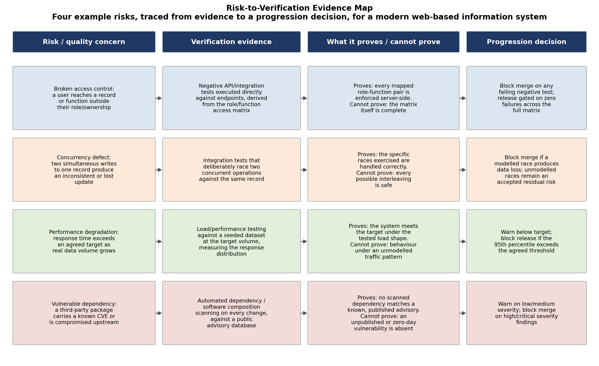

# Question 1: Quality Strategy and Risk-Based Verification

**Scope.** This is research for Milestone 3. It examines how a quality strategy can direct verification
effort by risk rather than attempting to test everything equally, for a modern web-based information
system that holds personal data and separates users by role. No test strategy, tool or coverage target
described here is selected for CivicConnect. Question 4 carries each finding forward as a decision M3
still has to make.

## Why quality strategy is not "test everything equally"

Quality assurance and quality control are related but distinct activities inside a wider quality
management effort. Quality assurance is the process-oriented half: it is concerned with whether the
right activities are being carried out, in the right way, to build confidence that quality requirements
will be met, and its defects-prevention focus means it operates earliest, before code exists to test
(ISTQB, no date). Quality control is the product-oriented half: it examines the actual product for
defects, most visibly through testing. The distinction matters practically because a team that only
resources quality control -- more testing, more scanning -- while leaving the process that produced the
defects unchanged will keep finding the same classes of problem release after release.

Verification and validation are a further distinction inside quality control. ISO/IEC/IEEE 29119-1
frames software testing as a major activity of verification, and separately notes that verification and
validation cover more than testing alone (ISO/IEC/IEEE, 2022). Verification asks whether the product was
built to its specification; validation asks whether the specification itself was the right thing to
build. A test suite that passes every specified case still says nothing about whether the specification
was correct in the first place -- which is the seed of the critical question addressed at the end of
this section.

Testing everything equally is also not achievable in practice. Exhaustive testing of any non-trivial
system is not feasible, which is why ISO/IEC/IEEE 29119-1 treats risk-based testing as the recommended
approach for prioritising effort: risk and requirements are linked to the test strategy, so that
verification depth follows where failure would matter most rather than following a fixed, uniform plan
(ISO/IEC/IEEE, 2022). Two dimensions drive that prioritisation. Likelihood is how probable a given
failure mode is, given the system's design and history -- a hand-written concurrency-sensitive operation
is more likely to contain a race condition than a single-writer configuration read. Impact is what the
failure would cost if it occurred -- data corruption in a financial or personal-data field costs more
than a cosmetic layout glitch. Criticality, the product of the two, is what should actually decide how
much verification effort a given area receives, not how easy or interesting that area is to test.

## Three complementary forms of verification evidence

No single form of verification evidence answers every question a quality strategy needs answered. The
three compared here were chosen because each is strong precisely where the others are weak.

**Unit testing.** Exercises a single function, method or class in isolation, with its dependencies
replaced or stubbed. It is fast and cheap to run, which means it can run on every change without
punishing development velocity, and a failure points directly at the unit responsible, which shortens
diagnosis. What it cannot prove: that the units behave correctly once wired together, or that the
system's actual data flow through several components produces the right outcome. A unit test can pass
perfectly while the integration between two correctly-tested units is broken.

**API and integration testing.** Exercises the boundary between components, or the system's actual
externally-callable interface, with real (or realistic) dependencies rather than stubs. This is where a
defect like a broken authorisation check becomes visible, because the test can be executed directly
against the endpoint the way an attacker or a misbehaving client would reach it, rather than through
the interface that was designed to prevent the action. What it cannot prove: that the system performs
acceptably under realistic load or data volume, or that every possible sequence of calls, not just the
ones exercised, is safe.

**Static analysis.** Examines source code without executing it, and can therefore run on code paths
that are hard to exercise through any test, and catch classes of defect -- an unvalidated input reaching
a dangerous function, a resource never released -- before a test would ever be written to find them.
Its limitation is what it does not, and structurally cannot, recognise. A recent survey of code review
research reports that static analysis tools such as PMD address only around sixteen percent of the
issues that manual reviewers actually identify (Singh et al., 2017, cited in Yang et al., 2026), because
a tool recognises patterns, not intent -- it cannot confirm that an access-control rule enforces the
policy the team actually meant, only that some check exists.

These three forms overlap only partially, and each leaves gaps the others were never intended to fill.
A quality strategy that reports "our unit tests pass" is describing one form of evidence among several,
not evidence of quality overall.

## Automation, quality gates, and their limits

Automating these forms of verification into a pipeline -- a quality gate that runs on every change and
blocks or warns depending on the result -- makes verification repeatable in a way manual execution
cannot match, and removes the temptation to skip a check under deadline pressure. This repeatability is
valuable, and it is also where the danger sits: a pipeline that runs the same fixed checks every time
can create the appearance of thoroughness that the checks themselves do not support.

The danger is not hypothetical. Pearce et al. (2022) prompted GitHub Copilot across 89 scenarios
relevant to common high-risk weaknesses, producing 1,689 generated programs, and found approximately
forty percent of them vulnerable -- output that would pass a build step and, in many cases, pass a test
suite written only to confirm the code runs, without a single line of it being secure. Perry et al.
(2023), in a controlled user study, went further: participants with access to an AI coding assistant
wrote significantly less secure code than a control group, while simultaneously rating their own code as
more secure than the control group rated theirs. That second finding matters specifically for quality
gates, because it describes a failure not in a tool but in the human judgement a gate is meant to
support -- confidence rose exactly where security fell, which is the opposite of what a gate's pass/fail
signal is supposed to produce.

Automated checks should therefore narrow what a reviewer needs to give close attention to, not replace
the judgement a reviewer applies. A quality gate is only as good as the set of checks configured into
it, and every configured check has a boundary past which it says nothing at all.

## Required visual: Risk-to-Verification Evidence Map

The map below traces four example risk classes -- chosen to be distinct failure modes a modern
web-based information system is likely to face -- from the risk itself, through the verification
evidence suited to it, to what that evidence does and does not prove, to a progression decision a
quality gate could enforce.

The reasoning the map is built to show, not just the list of testing types it contains: each row's
verification evidence was chosen because it is the form best positioned to expose that specific failure
mode, and each row's "cannot prove" column is not a caveat added for completeness -- it is what
determines whether the progression decision in that row should be an absolute block or a graduated
warning. The access-control and concurrency rows block outright, because the M1-style negative-test and
race-condition evidence behind them is close to exhaustive within its own scope. The performance and
dependency rows warn below a threshold and block only past it, because both forms of evidence are
inherently sampling a moving target -- real traffic patterns and newly published advisories -- rather
than confirming a fixed, enumerable property.

## Critical question: why "all automated tests passed" is not sufficient evidence of quality or release readiness

A passing pipeline is evidence that the checks configured into it found nothing wrong. It is not
evidence that the checks configured into it were the right ones, or that they were sufficient. Dijkstra
(1972) made the underlying point explicit almost as early as automated testing itself existed as a
discipline: program testing can show the presence of bugs, never their absence. A green pipeline
narrows the set of known, checked-for defects to zero occurrences; it says nothing about the defects
nobody wrote a check for.

Concretely, a fully passing pipeline still leaves several distinct claims unproven. That the
requirements being tested against are the right requirements -- validation, not verification, and no
amount of passing tests against a wrong specification fixes that. That the test suite's coverage is
representative of real usage, rather than of what was easiest to write a test for. That static analysis
and dependency scanning, bounded as shown above, have not simply failed to recognise a real defect
sitting outside their configured rules. And, following directly from Perry et al. (2023), that a
development process assisted by generative tools has not quietly produced code the team is more
confident in than the evidence actually supports.

The defensible reading of a fully green pipeline is narrow: within the rules the pipeline holds, on the
code it examined, at the time it ran, nothing recognisable was found wrong. Treating that as a
release-readiness verdict rather than one input to one requires exactly the human judgement automation
was never designed to replace.

## References

Dijkstra, E.W. (1972) 'The humble programmer', *Communications of the ACM*, 15(10), pp. 859-866.

ISO/IEC/IEEE (2022) *ISO/IEC/IEEE 29119-1:2022 Software and systems engineering -- Software testing --
Part 1: General concepts*. Geneva: International Organization for Standardization. Available at:
https://www.iso.org/standard/81291.html (Accessed: 24 September 2026).

ISTQB (no date) *Quality assurance*. ISTQB Glossary. Available at:
https://glossary.istqb.org/en_US/term/quality-assurance-3-2 (Accessed: 24 September 2026).

Pearce, H., Ahmad, B., Tan, B., Dolan-Gavitt, B. and Karri, R. (2022) 'Asleep at the keyboard? Assessing
the security of GitHub Copilot's code contributions', in *2022 IEEE Symposium on Security and Privacy
(SP)*. Preprint available at: https://arxiv.org/abs/2108.09293 (Accessed: 24 September 2026).

Perry, N., Srivastava, M., Kumar, D. and Boneh, D. (2023) 'Do users write more insecure code with AI
assistants?', in *Proceedings of the 2023 ACM SIGSAC Conference on Computer and Communications Security
(CCS 2023)*. doi: 10.1145/3576915.3623157.

Yang, Z., Gao, C., Guo, Z., Li, Z., Liu, K., Xia, X. and Zhou, Y. (2026) 'A roadmap on modern code
review: challenges and opportunities', arXiv preprint arXiv:2405.18216v2. Available at:
https://arxiv.org/abs/2405.18216v2 (Accessed: 24 September 2026).